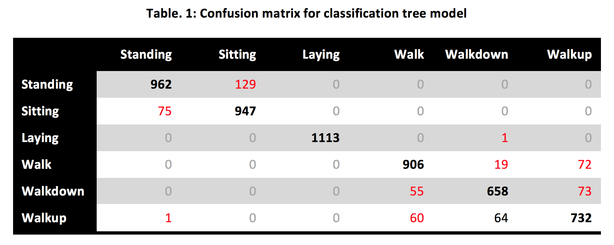
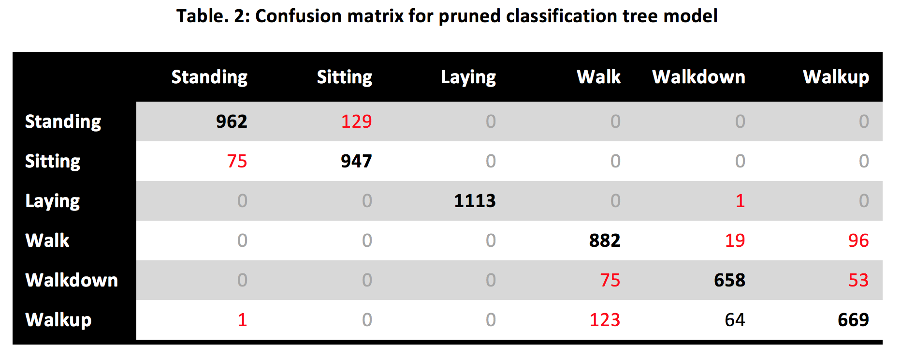
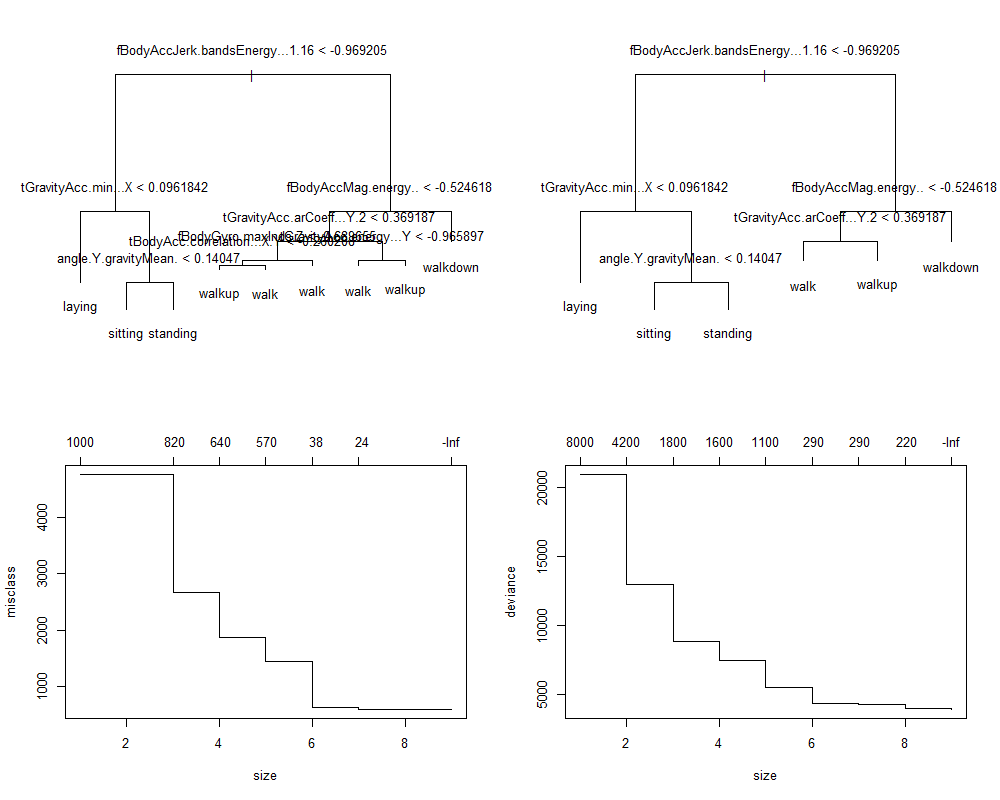

# **Prediction model for human activity based on smartphone sensors measurements**

*Assignment submitted for Coursera's Data Analysis (Johns Hopkins University) Course*

## **Introduction**

The Center for Machine Learning and Intelligent Systems at UCI carried out in 2012 a study in which they tried to relate data captured by smartphone embedded sensors to human activity. To do so, they had 30 volunteers between 19 and 48 years carry a Samsung galaxy SII smartphone on their waist while performing 6 different activities (Walking, Walking upstairs, Walking downstairs, Sitting, Standing and Laying). They ended up with a data set containing for each subject about 350 records of 3-axial linear acceleration and 3-axial angular velocity captured by the accelerometer and gyroscope embedded in the smartphone. The activities were filmed so researchers could manually label each one of the records in the data set to one of the 6 activities [1].

The present analysis aimed to build a model to predict what activity a subject is performing based on the quantitative measurements obtained from a smartphone. Using predictive modeling we showed that such a prediction model can be built using a classification tree and provide a very good level of accuracy using a fairly reduced set of smartphone measurements.       

## **Methods**

### *Data Collection*

For our analysis we used a sample of 7,352 records of smartphone activity data corresponding to 21 subjects (an average of 350 records per subject). The data were pre-processed from the original UCI dataset [1] and made available by the Data Analysis course team on Coursera [2]. The data were downloaded on March 10, 2013 using the R programming language [3].

### *Predictive Modeling*

To predict what activity a subject is performing based on the quantitative measurements obtained from Samsung phones, we constructed a predictive tree model [4].

The original dataset was split into, 1) a training set containing 80% of the original data (i.e., all records for subjects 1, 3, 5, 6 to 8, 11, 14 to 17, 19, 21 to 23, 25 and 26, that is 5,867 observations in total) and 2) a test set containing the remaining 20% of the original data (i.e., all records for subjects 27 to 30, that is 1,485 observations in total). The predictive tree was built on the training set and its accuracy assessed by looking at the substitution error rate, which is a measure of the difference between the predicted values of the trained model and the observed values in the training set. We then cross-validated the model with the goal to minimize the misclassification rate, by adjusting the size of the model so as to avoid overfitting the model to the training set while maintaining an acceptable accuracy. Another goal was to obtain a simple and easily interpretable model. We finally applied the prediction model on the test set that was reserved, so as to get a misclassification rate for a data set not at all related to the data we used to build the model. This last measure should therefore be considered a quite accurate measure of model accuracy.

### *Reproducibility*

All analyses performed in this manuscript are reproduced in the R markdown file [activityPredictionFinal.Rmd](code/activityPredictionFinal.Rmd) [5].

## **Analysis**

The Samsung phone activity data used in the present analysis contains records for 21 of the original 30 subjects. The data set contains 563 variables, of which 561 correspond to quantitative measurements of 3-axial linear acceleration and 3-axial angular velocity. The qualitative measurements are presented in the form of summary statistics for each one of the original measurements. The variable name identifies the variable (linear acceleration or angular velocity), the summary statistics and the axis. For example, the first variable of the data set is `tBodyAcc-mean()-X` which corresponds to the mean linear acceleration on the X axis. The last 2 variables are respectively a qualitative variable for subject identification (an integer between 1 and 30) and a qualitative variable related to the activity performed by the subject (possible levels are *Walking, Walking upstairs, Walking downstairs, Sitting, Standing and Laying*).

Since the data set was pre-processed, no missing values were identified. Once the original data set was subsetted into training and test data sets, the `subject` variable (in column 562) was eliminated from both data sets since it is neither an outcome variable nor a covariate. Another transformation consisted in setting the `activity` variable to be a factor variable in both the training and test sets. It also appeared that there were 84 duplicate column names, so we had to rename all the columns before being able to apply the modeling functions.

### *Model features and prediction function*

Since there were so many potential covariates for our model (561!) there was no obvious way to determine before hand which variables to include in our predictive model. On the other hand, the nature of the outcome variable (classification of an activity) seemed to call for a classification tree as predictive function. General linear model function were definitely out of the question since the outcome variable was not quantitative, while logistic regression models seemed quite difficult to apply in this case. And the good thing about classification tree models is that we could rely on the `tree` function in `R` to select the best covariates for our model.

We therefore used the `tree` function to build a prediction tree on the training data set and obtained in return the classification tree shown in *Fig. 1 - Upper Left Panel*. The resulting tree had 8 splits and 9 terminal nodes and summary statistics revealed a misclassification error rate of 0.09357, which means that the model could accurately classify the activity in more than 90% of the observations of the training data set.

The following table shows the confusion matrix for the classification tree, and reveals that prediction accuracy varied quite significantly from one activity to the other. Some activities were always accurately predicted (e.g., *laying*) while some other activities seemed more difficult to accurately predict (e.g., make the difference between walking activities).

### *Cross-validation*

When building a predictive model, there are 4 aspects of modeling that should be taken into account in order to make decisions on the final model:

- Accuracy
- Overfitting
- Interpretability
- Computational Speed

The first two aspects are of particular importance since in general some trade-offs should be made between getting better accuracy on training data set and avoiding overfitting data to training data set. Of the remaining two aspects, the computational speed is of lesser importance in our case, and model interpretability is somewhat subjective.

By cross-validating our classification tree model, we were able to determine that model size could be slightly reduced with a minimal variation in accuracy but a significant improvement in model simplicity and interpretability. As shown in *Fig. 1 - Lower Left Panel*, a significant reduction of the missclasification rate was observed for a model size of 6 or higher, but the difference in missclasification rate between size 6 and 8 was negligible. Looking at the prediction error on the deviance scale led to the same conclusion, as shown on *Fig. 1 - Lower Right Panel*. It should be noted though, that according to the cross-validation analysis, a bigger model size would still give us better prediction without risking overfitting, so our choice for the model size should depend more on other factors, like model simplicity and interpretability for instance. In our case, we decided to accept a slight reduction in accuracy (less that 1.5% difference in misclassification error rate) in order to produce a simpler model that was also more easily interpreted. We therefore pruned the original tree and requested a tree with exactly 6 terminal nodes, 1 node per activity level. The resulting tree is shown in *Fig. 1 - Upper Right Panel*. It has 6 terminal nodes as requested, only 5 splits, and its misclassification error rate is only 1.5% higher than that of the original tree. We therefore decided to keep this model, as it is simpler and easier to understand.

The confusion matrix for the pruned tree model that is shown below reveals that model simplification did not affect prediction accuracy for *standing*, *sitting*, *laying* and *walkdown* activities, which means that the decrease in prediction accuracy only slightly affected 2 of the 6 activities, namely *walk* and *walkup*.

### *Error rate on test data set*

The last step in building our prediction model was to apply it on the test data set that we separated from the original data set and estimate the misclassification rate of our model on this independent data set.

Our prediction model applied to the test data set gave a misclassification rate of 0.1380, which was only slightly higher than the error rate that was obtained on the training data set (0.1084). This result was a confirmation that our model was not overfitted to the training data set, since it could quite accurately predict activity on the test data set, and could therefore be considered a relatively accurate prediction model of human activity based on smartphone sensor measurements.

- **Upper Left Panel.** A classification tree of human activity based on smartphone sensors measurements. This is the original tree, which has 9 terminal nodes and 8 splits.
- **Upper Right Panel.** A pruned classification tree of human activity based on smartphone sensors measurements. This is the reduced-size classification tree with only 6 terminal nodes and 5 splits.
- **Lower Left Panel.** Evolution of the misclassification rate depending on model size. This figure shows that starting from size 6 the accuracy of the model does not significantly improve anymore with increased model size.
- **Lower Right Panel.** Evolution of the residual mean deviance depending on model size. This figure confirms what was observed for the misclassification rate, showing no substantial increase in model accuracy when model size is increased beyond 6.

## **Conclusions**

Our analysis was successful in building a model that could accurately predict human activity based on measurements from smartphone sensors. The final error rate obtained on the test data showed a rate of accurate activity classification around 87%, which suggested a very good predictive capability for this model. Also, the simplification made on the model allowed us to build an easily interpretable model that only depended on 5 covariates (out of 561) to produce an accurate result.

However, it should be noted that although prediction accuracy was almost perfect for *standing*, *sitting* and *laying* activities, it was not as good for walking activities. And confusion matrices revealed that the model could have a hard time making the difference between the various walking activities (i.e., *walk*, *walkup* and *walkdown*). Further work could therefore be done to improve model accuracy on walking activities, probably by collecting more observations for new subjects. Another more direct way, which was not explored here, could also be using bootstrapping techniques (e.g., random forests) to improve the accuracy of predictors. But since our goal to obtain an easily interpretable and sufficiently accurate model was attained, we decided not to go further in the quest for a more accurate prediction model.

## **References**

1. Human Activity Recognition Using Smartphones Data Set - UCI Center for Machine Learning and Intelligent Systems. URL: [http://archive.ics.uci.edu/ml/datasets/Human+Activity+Recognition+Using+Smartphones](http://archive.ics.uci.edu/ml/datasets/Human+Activity+Recognition+Using+Smartphones)
2. Samsung phone activity data. URL: [https://spark-public.s3.amazonaws.com/dataanalysis/samsungData.rda](https://spark-public.s3.amazonaws.com/dataanalysis/samsungData.rda) Accessed 03/10/2013
3. R Core Team (2012). ”R: A language and environment for statistical computing.” URL: [http://www.R-project.org](http://www.R-project.org)
4. Breiman L., Friedman J. H., Olshen R. A., and Stone, C. J. (1984) *Classification and Regression Trees*. Wadsworth.
5. R Markdown Page. URL: [http://www.rstudio.com/ide/docs/authoring/using_markdown](http://www.rstudio.com/ide/docs/authoring/using_markdown). Accessed 03/10/2013
