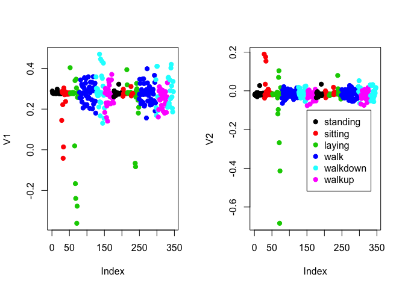
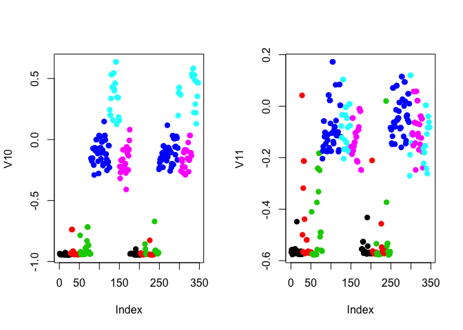
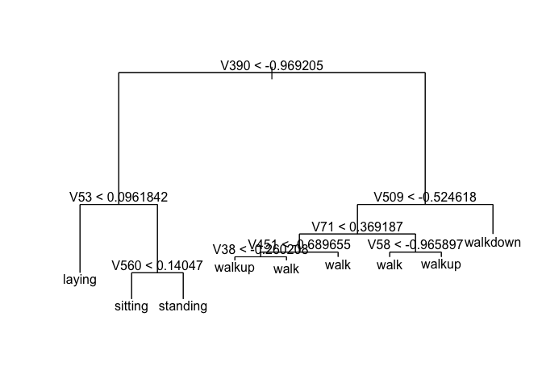
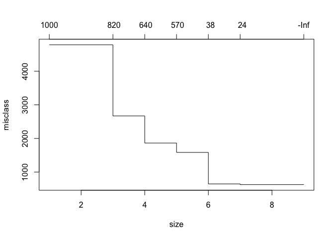
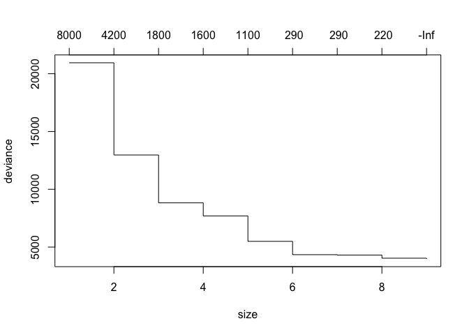
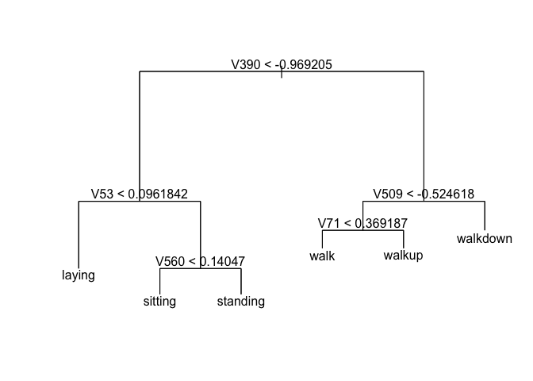
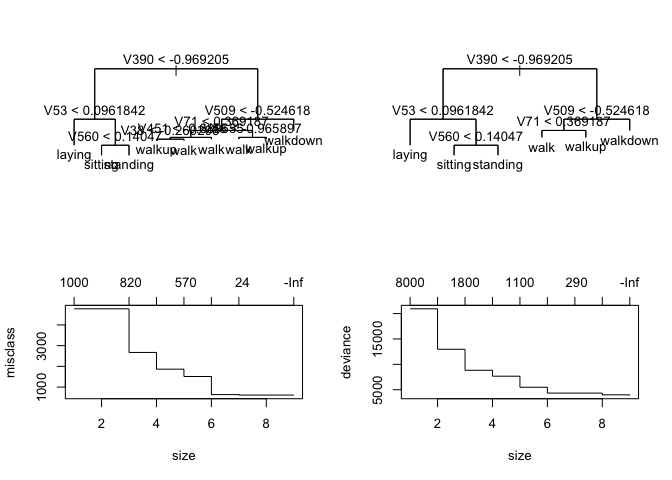

Samsung Activity Prediction Study
=================================

------

### Load libraries


```r
library(tree)
library(randomForest)
```

```
## randomForest 4.6-12
```

```
## Type rfNews() to see new features/changes/bug fixes.
```

------

## Processing

Download the data, read the data in and save the raw data as an RDA file


```r
#getwd()
#download.file("https://spark-public.s3.amazonaws.com/dataanalysis/samsungData.rda",destfi#le="../../data/samsungData.rda")
#dateDownloaded <- date()
#dateDownloaded
load('../data/samsungData.rda')
```


### Look at the data set


```r
dim(samsungData)
```

```
## [1] 7352  563
```

```r
samsungData <- data.frame(samsungData)
names(samsungData)[duplicated(names(samsungData))] # 84 duplicate column names found!
```

```
## character(0)
```

```r
samsungData <- data.frame(samsungData) # This removes duplicates
names(samsungData) <- c(paste0("V",c(1:561)),"subject","activity") # this should also solve it!
table(samsungData$activity)
```

```
##
##   laying  sitting standing     walk walkdown   walkup
##     1407     1286     1374     1226      986     1073
```

```r
sapply(samsungData[1,],class)
```

```
##          V1          V2          V3          V4          V5          V6
##   "numeric"   "numeric"   "numeric"   "numeric"   "numeric"   "numeric"
##          V7          V8          V9         V10         V11         V12
##   "numeric"   "numeric"   "numeric"   "numeric"   "numeric"   "numeric"
##         V13         V14         V15         V16         V17         V18
##   "numeric"   "numeric"   "numeric"   "numeric"   "numeric"   "numeric"
##         V19         V20         V21         V22         V23         V24
##   "numeric"   "numeric"   "numeric"   "numeric"   "numeric"   "numeric"
##         V25         V26         V27         V28         V29         V30
##   "numeric"   "numeric"   "numeric"   "numeric"   "numeric"   "numeric"
##         V31         V32         V33         V34         V35         V36
##   "numeric"   "numeric"   "numeric"   "numeric"   "numeric"   "numeric"
##         V37         V38         V39         V40         V41         V42
##   "numeric"   "numeric"   "numeric"   "numeric"   "numeric"   "numeric"
##         V43         V44         V45         V46         V47         V48
##   "numeric"   "numeric"   "numeric"   "numeric"   "numeric"   "numeric"
##         V49         V50         V51         V52         V53         V54
##   "numeric"   "numeric"   "numeric"   "numeric"   "numeric"   "numeric"
##         V55         V56         V57         V58         V59         V60
##   "numeric"   "numeric"   "numeric"   "numeric"   "numeric"   "numeric"
##         V61         V62         V63         V64         V65         V66
##   "numeric"   "numeric"   "numeric"   "numeric"   "numeric"   "numeric"
##         V67         V68         V69         V70         V71         V72
##   "numeric"   "numeric"   "numeric"   "numeric"   "numeric"   "numeric"
##         V73         V74         V75         V76         V77         V78
##   "numeric"   "numeric"   "numeric"   "numeric"   "numeric"   "numeric"
##         V79         V80         V81         V82         V83         V84
##   "numeric"   "numeric"   "numeric"   "numeric"   "numeric"   "numeric"
##         V85         V86         V87         V88         V89         V90
##   "numeric"   "numeric"   "numeric"   "numeric"   "numeric"   "numeric"
##         V91         V92         V93         V94         V95         V96
##   "numeric"   "numeric"   "numeric"   "numeric"   "numeric"   "numeric"
##         V97         V98         V99        V100        V101        V102
##   "numeric"   "numeric"   "numeric"   "numeric"   "numeric"   "numeric"
##        V103        V104        V105        V106        V107        V108
##   "numeric"   "numeric"   "numeric"   "numeric"   "numeric"   "numeric"
##        V109        V110        V111        V112        V113        V114
##   "numeric"   "numeric"   "numeric"   "numeric"   "numeric"   "numeric"
##        V115        V116        V117        V118        V119        V120
##   "numeric"   "numeric"   "numeric"   "numeric"   "numeric"   "numeric"
##        V121        V122        V123        V124        V125        V126
##   "numeric"   "numeric"   "numeric"   "numeric"   "numeric"   "numeric"
##        V127        V128        V129        V130        V131        V132
##   "numeric"   "numeric"   "numeric"   "numeric"   "numeric"   "numeric"
##        V133        V134        V135        V136        V137        V138
##   "numeric"   "numeric"   "numeric"   "numeric"   "numeric"   "numeric"
##        V139        V140        V141        V142        V143        V144
##   "numeric"   "numeric"   "numeric"   "numeric"   "numeric"   "numeric"
##        V145        V146        V147        V148        V149        V150
##   "numeric"   "numeric"   "numeric"   "numeric"   "numeric"   "numeric"
##        V151        V152        V153        V154        V155        V156
##   "numeric"   "numeric"   "numeric"   "numeric"   "numeric"   "numeric"
##        V157        V158        V159        V160        V161        V162
##   "numeric"   "numeric"   "numeric"   "numeric"   "numeric"   "numeric"
##        V163        V164        V165        V166        V167        V168
##   "numeric"   "numeric"   "numeric"   "numeric"   "numeric"   "numeric"
##        V169        V170        V171        V172        V173        V174
##   "numeric"   "numeric"   "numeric"   "numeric"   "numeric"   "numeric"
##        V175        V176        V177        V178        V179        V180
##   "numeric"   "numeric"   "numeric"   "numeric"   "numeric"   "numeric"
##        V181        V182        V183        V184        V185        V186
##   "numeric"   "numeric"   "numeric"   "numeric"   "numeric"   "numeric"
##        V187        V188        V189        V190        V191        V192
##   "numeric"   "numeric"   "numeric"   "numeric"   "numeric"   "numeric"
##        V193        V194        V195        V196        V197        V198
##   "numeric"   "numeric"   "numeric"   "numeric"   "numeric"   "numeric"
##        V199        V200        V201        V202        V203        V204
##   "numeric"   "numeric"   "numeric"   "numeric"   "numeric"   "numeric"
##        V205        V206        V207        V208        V209        V210
##   "numeric"   "numeric"   "numeric"   "numeric"   "numeric"   "numeric"
##        V211        V212        V213        V214        V215        V216
##   "numeric"   "numeric"   "numeric"   "numeric"   "numeric"   "numeric"
##        V217        V218        V219        V220        V221        V222
##   "numeric"   "numeric"   "numeric"   "numeric"   "numeric"   "numeric"
##        V223        V224        V225        V226        V227        V228
##   "numeric"   "numeric"   "numeric"   "numeric"   "numeric"   "numeric"
##        V229        V230        V231        V232        V233        V234
##   "numeric"   "numeric"   "numeric"   "numeric"   "numeric"   "numeric"
##        V235        V236        V237        V238        V239        V240
##   "numeric"   "numeric"   "numeric"   "numeric"   "numeric"   "numeric"
##        V241        V242        V243        V244        V245        V246
##   "numeric"   "numeric"   "numeric"   "numeric"   "numeric"   "numeric"
##        V247        V248        V249        V250        V251        V252
##   "numeric"   "numeric"   "numeric"   "numeric"   "numeric"   "numeric"
##        V253        V254        V255        V256        V257        V258
##   "numeric"   "numeric"   "numeric"   "numeric"   "numeric"   "numeric"
##        V259        V260        V261        V262        V263        V264
##   "numeric"   "numeric"   "numeric"   "numeric"   "numeric"   "numeric"
##        V265        V266        V267        V268        V269        V270
##   "numeric"   "numeric"   "numeric"   "numeric"   "numeric"   "numeric"
##        V271        V272        V273        V274        V275        V276
##   "numeric"   "numeric"   "numeric"   "numeric"   "numeric"   "numeric"
##        V277        V278        V279        V280        V281        V282
##   "numeric"   "numeric"   "numeric"   "numeric"   "numeric"   "numeric"
##        V283        V284        V285        V286        V287        V288
##   "numeric"   "numeric"   "numeric"   "numeric"   "numeric"   "numeric"
##        V289        V290        V291        V292        V293        V294
##   "numeric"   "numeric"   "numeric"   "numeric"   "numeric"   "numeric"
##        V295        V296        V297        V298        V299        V300
##   "numeric"   "numeric"   "numeric"   "numeric"   "numeric"   "numeric"
##        V301        V302        V303        V304        V305        V306
##   "numeric"   "numeric"   "numeric"   "numeric"   "numeric"   "numeric"
##        V307        V308        V309        V310        V311        V312
##   "numeric"   "numeric"   "numeric"   "numeric"   "numeric"   "numeric"
##        V313        V314        V315        V316        V317        V318
##   "numeric"   "numeric"   "numeric"   "numeric"   "numeric"   "numeric"
##        V319        V320        V321        V322        V323        V324
##   "numeric"   "numeric"   "numeric"   "numeric"   "numeric"   "numeric"
##        V325        V326        V327        V328        V329        V330
##   "numeric"   "numeric"   "numeric"   "numeric"   "numeric"   "numeric"
##        V331        V332        V333        V334        V335        V336
##   "numeric"   "numeric"   "numeric"   "numeric"   "numeric"   "numeric"
##        V337        V338        V339        V340        V341        V342
##   "numeric"   "numeric"   "numeric"   "numeric"   "numeric"   "numeric"
##        V343        V344        V345        V346        V347        V348
##   "numeric"   "numeric"   "numeric"   "numeric"   "numeric"   "numeric"
##        V349        V350        V351        V352        V353        V354
##   "numeric"   "numeric"   "numeric"   "numeric"   "numeric"   "numeric"
##        V355        V356        V357        V358        V359        V360
##   "numeric"   "numeric"   "numeric"   "numeric"   "numeric"   "numeric"
##        V361        V362        V363        V364        V365        V366
##   "numeric"   "numeric"   "numeric"   "numeric"   "numeric"   "numeric"
##        V367        V368        V369        V370        V371        V372
##   "numeric"   "numeric"   "numeric"   "numeric"   "numeric"   "numeric"
##        V373        V374        V375        V376        V377        V378
##   "numeric"   "numeric"   "numeric"   "numeric"   "numeric"   "numeric"
##        V379        V380        V381        V382        V383        V384
##   "numeric"   "numeric"   "numeric"   "numeric"   "numeric"   "numeric"
##        V385        V386        V387        V388        V389        V390
##   "numeric"   "numeric"   "numeric"   "numeric"   "numeric"   "numeric"
##        V391        V392        V393        V394        V395        V396
##   "numeric"   "numeric"   "numeric"   "numeric"   "numeric"   "numeric"
##        V397        V398        V399        V400        V401        V402
##   "numeric"   "numeric"   "numeric"   "numeric"   "numeric"   "numeric"
##        V403        V404        V405        V406        V407        V408
##   "numeric"   "numeric"   "numeric"   "numeric"   "numeric"   "numeric"
##        V409        V410        V411        V412        V413        V414
##   "numeric"   "numeric"   "numeric"   "numeric"   "numeric"   "numeric"
##        V415        V416        V417        V418        V419        V420
##   "numeric"   "numeric"   "numeric"   "numeric"   "numeric"   "numeric"
##        V421        V422        V423        V424        V425        V426
##   "numeric"   "numeric"   "numeric"   "numeric"   "numeric"   "numeric"
##        V427        V428        V429        V430        V431        V432
##   "numeric"   "numeric"   "numeric"   "numeric"   "numeric"   "numeric"
##        V433        V434        V435        V436        V437        V438
##   "numeric"   "numeric"   "numeric"   "numeric"   "numeric"   "numeric"
##        V439        V440        V441        V442        V443        V444
##   "numeric"   "numeric"   "numeric"   "numeric"   "numeric"   "numeric"
##        V445        V446        V447        V448        V449        V450
##   "numeric"   "numeric"   "numeric"   "numeric"   "numeric"   "numeric"
##        V451        V452        V453        V454        V455        V456
##   "numeric"   "numeric"   "numeric"   "numeric"   "numeric"   "numeric"
##        V457        V458        V459        V460        V461        V462
##   "numeric"   "numeric"   "numeric"   "numeric"   "numeric"   "numeric"
##        V463        V464        V465        V466        V467        V468
##   "numeric"   "numeric"   "numeric"   "numeric"   "numeric"   "numeric"
##        V469        V470        V471        V472        V473        V474
##   "numeric"   "numeric"   "numeric"   "numeric"   "numeric"   "numeric"
##        V475        V476        V477        V478        V479        V480
##   "numeric"   "numeric"   "numeric"   "numeric"   "numeric"   "numeric"
##        V481        V482        V483        V484        V485        V486
##   "numeric"   "numeric"   "numeric"   "numeric"   "numeric"   "numeric"
##        V487        V488        V489        V490        V491        V492
##   "numeric"   "numeric"   "numeric"   "numeric"   "numeric"   "numeric"
##        V493        V494        V495        V496        V497        V498
##   "numeric"   "numeric"   "numeric"   "numeric"   "numeric"   "numeric"
##        V499        V500        V501        V502        V503        V504
##   "numeric"   "numeric"   "numeric"   "numeric"   "numeric"   "numeric"
##        V505        V506        V507        V508        V509        V510
##   "numeric"   "numeric"   "numeric"   "numeric"   "numeric"   "numeric"
##        V511        V512        V513        V514        V515        V516
##   "numeric"   "numeric"   "numeric"   "numeric"   "numeric"   "numeric"
##        V517        V518        V519        V520        V521        V522
##   "numeric"   "numeric"   "numeric"   "numeric"   "numeric"   "numeric"
##        V523        V524        V525        V526        V527        V528
##   "numeric"   "numeric"   "numeric"   "numeric"   "numeric"   "numeric"
##        V529        V530        V531        V532        V533        V534
##   "numeric"   "numeric"   "numeric"   "numeric"   "numeric"   "numeric"
##        V535        V536        V537        V538        V539        V540
##   "numeric"   "numeric"   "numeric"   "numeric"   "numeric"   "numeric"
##        V541        V542        V543        V544        V545        V546
##   "numeric"   "numeric"   "numeric"   "numeric"   "numeric"   "numeric"
##        V547        V548        V549        V550        V551        V552
##   "numeric"   "numeric"   "numeric"   "numeric"   "numeric"   "numeric"
##        V553        V554        V555        V556        V557        V558
##   "numeric"   "numeric"   "numeric"   "numeric"   "numeric"   "numeric"
##        V559        V560        V561     subject    activity
##   "numeric"   "numeric"   "numeric"   "integer" "character"
```

```r
samsungData$activity <- sapply(samsungData$activity, factor) # set 'activity' variable to be a factor
table(samsungData$subject)
```

```
##
##   1   3   5   6   7   8  11  14  15  16  17  19  21  22  23  25  26  27
## 347 341 302 325 308 281 316 323 328 366 368 360 408 321 372 409 392 376
##  28  29  30
## 382 344 383
```

```r
length(unique(samsungData$subject))
```

```
## [1] 21
```


### Find out about missing values and take out imcomplete cases


```r
table(is.na(samsungData))
```

```
##
##   FALSE
## 4139176
```

### Building training and test sets and make necessary transformations


```r
trainData <- samsungData[samsungData$subject %in% c(1,3,5,6,7,8,11,14,15,16,17,19,21,22,23,25,26),]
trainData <- trainData[,-562] # Eliminate subject variable
testData <- samsungData[samsungData$subject %in% c(27,28,29,30),]
testData <- testData[,-562] # Eliminate subject variable
```


------

## Exploratory Analysis

### Plotting average acceleration for first subject


```r
par(mfrow=c(1,2))
numericActivity <- as.numeric(as.factor(samsungData$activity))[samsungData$subject==1]
plot(samsungData[samsungData$subject==1,1], pch=19, col=numericActivity, ylab=names(samsungData)[1])
plot(samsungData[samsungData$subject==1,2], pch=19, col=numericActivity, ylab=names(samsungData)[2])
legend(150, -0.1, legend=unique(samsungData$activity), col=unique(numericActivity), pch=19)
```

<!-- -->


### Plotting max acceleration for first subject


```r
par(mfrow=c(1,2))
plot(samsungData[samsungData$subject==1,10], pch=19, col=numericActivity, ylab=names(samsungData)[10])
plot(samsungData[samsungData$subject==1,11], pch=19, col=numericActivity, ylab=names(samsungData)[11])
```

<!-- -->


------

## Predictive Modeling


## Build a predictive tree model from the training data set


```r
tree1 <- tree(activity ~ ., data=trainData)
summary(tree1)
```

```
##
## Classification tree:
## tree(formula = activity ~ ., data = trainData)
## Variables actually used in tree construction:
## [1] "V390" "V53"  "V560" "V509" "V71"  "V451" "V38"  "V58"
## Number of terminal nodes:  9
## Residual mean deviance:  0.5871 = 3439 / 5858
## Misclassification error rate: 0.09357 = 549 / 5867
```

```r
plot(tree1)
text(tree1)
```

<!-- -->


## Cross-validate tree model


```r
plot(cv.tree(tree1,FUN=prune.tree,method="misclass"))
```

<!-- -->

```r
plot(cv.tree(tree1))
```

<!-- -->


## Prune the tree


```r
pruneTree <- prune.tree(tree1, best=6)
summary(pruneTree)
```

```
##
## Classification tree:
## snip.tree(tree = tree1, nodes = 12:13)
## Variables actually used in tree construction:
## [1] "V390" "V53"  "V560" "V509" "V71"
## Number of terminal nodes:  6
## Residual mean deviance:  0.7217 = 4230 / 5861
## Misclassification error rate: 0.1084 = 636 / 5867
```

```r
plot(pruneTree)
text(pruneTree)
```

<!-- -->


## Show resubstitution error


```r
table(trainData$activity, predict(pruneTree,type="class"))
```

```
##           
##            standing sitting laying walk walkdown walkup
##   standing      962     129      0    0        0      0
##   sitting        75     947      0    0        0      0
##   laying          0       0   1113    0        1      0
##   walk            0       0      0  882       19     96
##   walkdown        0       0      0   75      658     53
##   walkup          1       0      0  123       64    669
```

```r
table(trainData$activity, predict(tree1,type="class"))
```

```
##           
##            standing sitting laying walk walkdown walkup
##   standing      962     129      0    0        0      0
##   sitting        75     947      0    0        0      0
##   laying          0       0   1113    0        1      0
##   walk            0       0      0  906       19     72
##   walkdown        0       0      0   55      658     73
##   walkup          1       0      0   60       64    732
```

```r
sum(predict(pruneTree,type="class") != trainData$activity)/length(trainData$activity)
```

```
## [1] 0.1084029
```

```r
sum(predict(tree1,type="class") != trainData$activity)/length(trainData$activity)
```

```
## [1] 0.09357423
```


## Random forest


```r
forest1 <- randomForest(activity ~ ., data=trainData, prox=TRUE)
forest1
```

```
##
## Call:
##  randomForest(formula = activity ~ ., data = trainData, prox = TRUE)
##                Type of random forest: classification
##                      Number of trees: 500
## No. of variables tried at each split: 23
##
##         OOB estimate of  error rate: 1.59%
## Confusion matrix:
##          standing sitting laying walk walkdown walkup class.error
## standing     1059      32      0    0        0      0  0.02933089
## sitting        29     992      0    0        0      1  0.02935421
## laying          0       0   1114    0        0      0  0.00000000
## walk            0       0      0  985        7      5  0.01203611
## walkdown        0       0      0    4      776      6  0.01272265
## walkup          0       0      0    1        8    848  0.01050175
```

```r
sum(predict(forest1, type="class") != trainData$activity)/length(trainData$activity)
```

```
## [1] 0.01585137
```


## Prediction with test set


```r
sum(predict(tree1, testData, type="class") != testData$activity)/length(testData$activity)
```

```
## [1] 0.1104377
```

```r
sum(predict(pruneTree, testData, type="class") != testData$activity)/length(testData$activity)
```

```
## [1] 0.1380471
```

```r
sum(predict(forest1, testData, type="class") != testData$activity)/length(testData$activity)
```

```
## [1] 0.04646465
```

## Final graphs


```r
par(mfrow=c(2,2))
plot(tree1)
text(tree1)
plot(pruneTree)
text(pruneTree)
plot(cv.tree(tree1,FUN=prune.tree,method="misclass"))
plot(cv.tree(tree1))
```

<!-- -->
