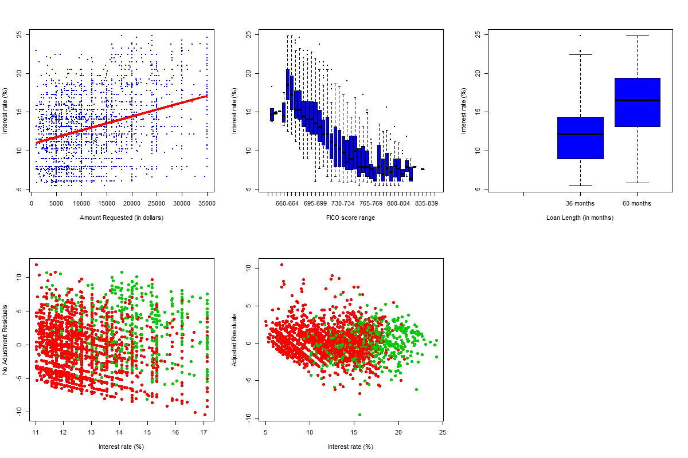

# **Increased interest rates are associated with increased requested loan amounts and lower FICO scores**

*Assignment submitted for Coursera's Data Analysis (Johns Hopkins University) Course*

## **Introduction**

Lending Club [1] is an online peer-to-peer lending company, which brings together people in need of credit (borrowers) with people who want to get a return on their savings (investors). The online platform claims to make the whole process of lending and borrowing faster and better by reducing cost and complexity compared with conventional banking, hence offering better rates to borrowers and better returns to investors. The whole process relies on assigning a grade to loan requests made by borrowers depending on their credit score, credit history, desired loan amount and debt-to-income ratio [2]. The assigned grades then determine interest rate and fees payable by the borrower for the requested loan. Grades range from A1 (lowest rate) to G5 (highest rate) with corresponding rates ranging from 6.03% to 24.89% as of 2/16/2013 [3]. Investors can then choose between lower-risk (high grade) lower-return investments or higher risk (low grade) higher return investment.

The present analysis aims to better understanding the associations between the interest rate of the loans and the other variables related to loan applications and the credit worthiness of borrowers, like FICO score, credit history, employment history, debt-to-income ratio, loan amount requested or loan length. Using exploratory analysis and standard multiple regression techniques we show that there is a significant relationship between the interest rate, the amount requested in the loan application and the FICO score range, even after adjusting for important confounders such as the loan length. Our analysis suggests that a higher requested loan amount is associated with an increased interest rate and that a lower FICO score is associated with a higher interest rate.       

## **Methods**

### *Data Collection*

For our analysis we used a sample of 2,500 peer-to-peer loans issued through the Lending Club and provided by the Data Analysis course team on Coursera [4]. The data were downloaded on February 16, 2013 using the R programming language [5].

### *Exploratory Analysis*

Exploratory analysis was performed by examining tables and plots of the observed data. We identified transformations to perform on the raw data on the basis of plots and knowledge of the scale of measured variables. Exploratory analysis was used to

1. identify missing values
2. verify the quality of the data
3. determine the terms used in the regression model relating the interest rate to the other variables

### *Statistical Modeling*

To relate Lending Club interest rate to FICO score and other variables we performed a standard multivariate linear regression model [6]. Model selection was performed on the basis of our exploratory analysis and prior knowledge of the relationship between credit worthiness and variables such as FICO score, credit history, employment history, debt-to-income ratio and loan amount requested. Coefficients were estimated with ordinary least squares.

### *Reproducibility*

All analyses performed in this manuscript are reproduced in the R markdown file [lendingclubFinal.Rmd](code/lendingclubFinal.md) [7].

## **Results**

The Lending Club data used in this analysis contains information on the amount (in dollars) requested in the loan application *[Amount.Requested]*, the amount in dollars loaned to the individual *[Amount.Funded.By.Investors]*, the lending interest rate *[Interest.Rate]*, the length of time (in month) of the loan *[Loan.Length]*, the purpose of the loan as stated by the applicant *[Loan.Purpose]*, the percentage of the applicant’s gross income that goes toward paying debts *[Debt.To.Income.Ratio]*, the abbreviation for the U.S. state of residence of the applicant *[State]*, a variable indicating whether the applicant owns, rents, or has a mortgage on their home *[Home.Ownership]*, the monthly income of the applicant (in dollars) *[Monthly.Income]*, a range indicating the applicant's FICO score, a measure of the credit worthiness of the applicant *[FICO.Range]*, the number of open lines of credit the applicant had at the time of application *[Open.CREDIT.Lines]*, the total amount outstanding all lines of credit of the applicant *[Revolving.CREDIT.Balance]*, the number of authorized queries about the applicant's credit worthiness in the last 6 months before the loan was issued *[Inquiries.in.the.Last.6.Months]*, the length of time the applicant has been employed at current job *[Employment.Length]* [4].

A few missing values were identified in the data set (7 out of 35000 data points) and corresponding cases where therefore removed (2 cases out of 2,500). Also, a quick glance at the data set revealed that the *Interest.Rate* and *Debt.To.Income.Ratio* variables were incorrectly classified as `factor` when they should in fact be classified as `numeric`. Both variables are percentages with values ending with the *%* symbol, which prevents `R` from classifiying them as `numeric` type. Both variables were therefore transformed to `numeric` type using the `sub`  and `as.numeric` functions.
Finally, exploratory graphs revealed the existence of some extreme points within the *Monthly.Income* and *Revolving.CREDIT.Balance* variables. The cases containing these outliers (9 in total) were removed prior to statistical modeling in order to improve statistical significance of regression models. After removing cases with missing values and outliers, the sample to be analyzed was reduced to 2,489 cases. All other variables were observed to be inside the standard ranges.

The distribution of requested loan amounts is slightly right skewed. Half the requests were for amounts inferior or equal to $10,000 and the maximum requested amount was $35,000. More than 90% of applicants were loaned the full requested amount (or almost the full amount). Less than 1% of applicants in this sample had their loan request rejected. The distribution of interest rates was almost normaly distributed, and the average interest rate was around 13%. The debt-to-income ratio was also normally distributed and centered around a value of 15%. The distribution of monthly income was right skewed, and a majority of applicants had a monthly income in the $2,500 - $7,500 range. The distribution of the number of open lines of credit and of the total amount outstanding all lines were also right skewed. Most applicants had between 5 and 15 credit lines open at the time of application for a total amount generally inferior to $20,000. Finally, the number of inquiries about the applicant's credit worthiness in the last 6 months was between 0 and 1 for 75% of the applicants, which means that most of them didn't ask for any loan in the last 6 months. From this exploratory analysis we can already conclude that the great majority of loan requests from this sample originated from very solvent borrowers, since most of them were reasonably in debt and with good monthly incomes at the time of application.

A scatter plot of the interest rate versus the FICO score range revealed a clear inverse linear relationship between both variables, with a lower FICO score corresponding to higher interest rates. A second scatter plot of the interest rate versus the amount request also showed a highly significant association between both variables. We first fit a regression model relating interest rate to amount requested and then attempted to explain the non-random patterns observed in the residuals by fitting models including the FICO score range and a potential confounder, the loan length. Our final regression model was:

**Interest.Rate  = b0 + b1(Amount.Requested) + f(Loan.Length) + g(FICO.Range) + e**

where b0 is an intercept term and b1 represents the change in interest rate associated with a change in amount requested for a same FICO score and loan length. The terms f(Loan.Length) and g(FICO.Range) represent factor models with 38 different levels for FICO score ranges and 2 different levels for loan length. The error term e represents all sources of unmeasured and unmodeled random variation in earthquake magnitude. Our final regression model appeared to remove most of the non-random patterns of variation in the residuals.

We observed a highly statistically significant (P < 2e-16) association between interest rate and amount requested. A change of one dollar of requested amount corresponded to a change of b1 = 0.0001445 in percent of interest rate (95% Confidence Interval: 0.0001336, 0.0001554). So for example, for two loans of the same length and whith the same applicant's FICO score, we would expect a $20,000 loan request to have an interest rate 1.445% higher than a $10,000 loan request. We would expect the same difference between a $30,000 and $20,000 loan requests and so forth.

## **Conclusions**

Our analysis suggests that there is a significant, positive association between the interest rates offered by Lending Club and the amount requested in the loan application. Our analysis estimates the relationship using a linear model relating amount requested to interest rate. We also observed that other variables such as FICO score range and lona length are associated with both amount requested and interest rate. Including these variables in the regression model relating interest rate to amount requested improves the model fit, but does not remove the significant positive relationship between the variables.

## **References**

1. Lending Club webpage. URL: [http://www.lendingclub.com/](http://www.lendingclub.com/)
2. Wikipedia "Lending Club" page, "Overview" section. URL: [http://en.wikipedia.org/wiki/Lending_Club#Overview](http://en.wikipedia.org/wiki/Lending_Club#Overview) Accessed 2/16/2013
3. Lending Club page on rates and fees. URL: [https://www.lendingclub.com/public/rates-and-fees.action](https://www.lendingclub.com/public/rates-and-fees.action) Accessed 2/16/2013
4. Loans data fron Lending Club. URL: [https://spark-public.s3.amazonaws.com/dataanalysis/loansData.rda](https://spark-public.s3.amazonaws.com/dataanalysis/loansData.rda) Accessed 2/16/2013
5. R Core Team (2012). ”R: A language and environment for statistical computing.” URL: [http://www.R-project.org](http://www.R-project.org)
6. Seber, George AF, and Alan J. Lee. Linear regression analysis. Vol. 936. Wiley, 2012.
7. R Markdown Page. URL: [http://www.rstudio.com/ide/docs/authoring/using_markdown](http://www.rstudio.com/ide/docs/authoring/using_markdown). Accessed 2/16/2013
