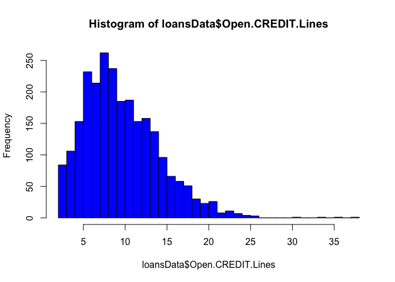

Lending Club Analysis
=====================

------

### Load libraries


```r
library(Hmisc)
```

```
## Loading required package: lattice
```

```
## Loading required package: survival
```

```
## Loading required package: Formula
```

```
## Loading required package: ggplot2
```

```
##
## Attaching package: 'Hmisc'
```

```
## The following objects are masked from 'package:base':
##
##     format.pval, round.POSIXt, trunc.POSIXt, units
```


------

## Processing

Download the data, read the data in and save the raw data as an RDA file


```r
getwd()
```

```
## [1] "/Users/dtavan/Projects/ds-portfolio/loan-interest-prediction/code"
```

```r
#download.file("https://spark-public.s3.amazonaws.com/dataanalysis/loansData.rda",destfile="../../data/loansData.rda")
#dateDownloaded <- date()
#dateDownloaded
load('../data/loansData.rda')
```


### Look at the data set


```r
dim(loansData)
```

```
## [1] 2500   14
```

```r
head(loansData)
```

```
##       Amount.Requested Amount.Funded.By.Investors Interest.Rate
## 81174            20000                      20000         8.90%
## 99592            19200                      19200        12.12%
## 80059            35000                      35000        21.98%
## 15825            10000                       9975         9.99%
## 33182            12000                      12000        11.71%
## 62403             6000                       6000        15.31%
##       Loan.Length       Loan.Purpose Debt.To.Income.Ratio State
## 81174   36 months debt_consolidation               14.90%    SC
## 99592   36 months debt_consolidation               28.36%    TX
## 80059   60 months debt_consolidation               23.81%    CA
## 15825   36 months debt_consolidation               14.30%    KS
## 33182   36 months        credit_card               18.78%    NJ
## 62403   36 months              other               20.05%    CT
##       Home.Ownership Monthly.Income FICO.Range Open.CREDIT.Lines
## 81174       MORTGAGE        6541.67    735-739                14
## 99592       MORTGAGE        4583.33    715-719                12
## 80059       MORTGAGE       11500.00    690-694                14
## 15825       MORTGAGE        3833.33    695-699                10
## 33182           RENT        3195.00    695-699                11
## 62403            OWN        4891.67    670-674                17
##       Revolving.CREDIT.Balance Inquiries.in.the.Last.6.Months
## 81174                    14272                              2
## 99592                    11140                              1
## 80059                    21977                              1
## 15825                     9346                              0
## 33182                    14469                              0
## 62403                    10391                              2
##       Employment.Length
## 81174          < 1 year
## 99592           2 years
## 80059           2 years
## 15825           5 years
## 33182           9 years
## 62403           3 years
```

```r
summary(loansData)
```

```
##  Amount.Requested Amount.Funded.By.Investors Interest.Rate
##  Min.   : 1000    Min.   :   -0.01           12.12% : 122  
##  1st Qu.: 6000    1st Qu.: 6000.00           7.90%  : 119  
##  Median :10000    Median :10000.00           13.11% : 115  
##  Mean   :12406    Mean   :12001.57           15.31% :  76  
##  3rd Qu.:17000    3rd Qu.:16000.00           14.09% :  72  
##  Max.   :35000    Max.   :35000.00           14.33% :  69  
##                                              (Other):1927  
##     Loan.Length               Loan.Purpose  Debt.To.Income.Ratio
##           :   0   debt_consolidation:1307   0%     :   8        
##  36 months:1952   credit_card       : 444   12.54% :   6        
##  60 months: 548   other             : 201   12.20% :   5        
##                   home_improvement  : 152   12.85% :   5        
##                   major_purchase    : 101   14.22% :   5        
##                   small_business    :  87   14.66% :   5        
##                   (Other)           : 208   (Other):2466        
##      State       Home.Ownership Monthly.Income       FICO.Range  
##  CA     : 433           :   0   Min.   :   588.5   670-674: 171  
##  NY     : 255   MORTGAGE:1148   1st Qu.:  3500.0   675-679: 166  
##  TX     : 174   NONE    :   1   Median :  5000.0   680-684: 157  
##  FL     : 169   OTHER   :   5   Mean   :  5688.9   695-699: 153  
##  IL     : 101   OWN     : 200   3rd Qu.:  6800.0   665-669: 145  
##  GA     :  98   RENT    :1146   Max.   :102750.0   690-694: 140  
##  (Other):1270                   NA's   :1          (Other):1568  
##  Open.CREDIT.Lines Revolving.CREDIT.Balance Inquiries.in.the.Last.6.Months
##  Min.   : 2.00     Min.   :     0           Min.   :0.0000                
##  1st Qu.: 7.00     1st Qu.:  5586           1st Qu.:0.0000                
##  Median : 9.00     Median : 10962           Median :0.0000                
##  Mean   :10.08     Mean   : 15245           Mean   :0.9063                
##  3rd Qu.:13.00     3rd Qu.: 18889           3rd Qu.:1.0000                
##  Max.   :38.00     Max.   :270800           Max.   :9.0000                
##  NA's   :2         NA's   :2                NA's   :2                     
##  Employment.Length
##  10+ years:653    
##  < 1 year :250    
##  2 years  :244    
##  3 years  :235    
##  5 years  :202    
##  4 years  :192    
##  (Other)  :724
```

```r
sapply(loansData[1,],class)
```

```
##               Amount.Requested     Amount.Funded.By.Investors
##                      "integer"                      "numeric"
##                  Interest.Rate                    Loan.Length
##                       "factor"                       "factor"
##                   Loan.Purpose           Debt.To.Income.Ratio
##                       "factor"                       "factor"
##                          State                 Home.Ownership
##                       "factor"                       "factor"
##                 Monthly.Income                     FICO.Range
##                      "numeric"                       "factor"
##              Open.CREDIT.Lines       Revolving.CREDIT.Balance
##                      "integer"                      "integer"
## Inquiries.in.the.Last.6.Months              Employment.Length
##                      "integer"                       "factor"
```

*Interest.Rate* and *Debt.To.Income.Ratio* variables have to be transformed from `factor` type to `numeric type`


### Fix columns that have wrong variable types

```r
loansData <- transform(loansData, Interest.Rate = as.numeric(sub("%","",Interest.Rate)),
                       Debt.To.Income.Ratio = as.numeric(sub("%","",Debt.To.Income.Ratio)))
```


### Find out about missing values and take out imcomplete cases


```r
table(is.na(loansData))
```

```
##
## FALSE  TRUE
## 34993     7
```

```r
loansData <- loansData[complete.cases(loansData),]
```


### Add a variable corresponding the percentage of the requested amount that was finally loaned to the applicant


```r
Percent.Funded <- round(100*(1 - (loansData$Amount.Requested-loansData$Amount.Funded.By.Investors)/loansData$Amount.Requested), 2)
loansData$Percent.Funded <- Percent.Funded
```


------

## Exploratory analysis

### Make some univariate tables


```r
length(unique(loansData$Interest.Rate))
```

```
## [1] 273
```

```r
length(unique(loansData$Debt.To.Income.Ratio))
```

```
## [1] 1668
```

```r
length(unique(loansData$Loan.Purpose))
```

```
## [1] 14
```

```r
length(unique(loansData$FICO.Range))
```

```
## [1] 38
```

```r
length(unique(loansData$Employment.Length))
```

```
## [1] 12
```

```r
table(loansData$Loan.Purpose)
```

```
##
##                                   car        credit_card
##                  0                 50                444
## debt_consolidation        educational   home_improvement
##               1307                 15                152
##              house     major_purchase            medical
##                 20                101                 30
##             moving              other   renewable_energy
##                 29                199                  4
##     small_business           vacation            wedding
##                 87                 21                 39
```

```r
table(loansData$State)
```

```
##
##      AK  AL  AR  AZ  CA  CO  CT  DC  DE  FL  GA  HI  IA  ID  IL  IN  KS
##   0  11  38  13  46 433  61  50  11   8 169  98  12   1   0 101   3  21
##  KY  LA  MA  MD  ME  MI  MN  MO  MS  MT  NC  NE  NH  NJ  NM  NV  NY  OH
##  23  22  73  68   0  45  38  33   1   7  64   0  15  94  13  32 253  71
##  OK  OR  PA  RI  SC  SD  TN  TX  UT  VA  VT  WA  WI  WV  WY
##  21  30  96  15  28   4   0 174  16  78   5  58  26  15   4
```

```r
table(loansData$FICO.Range)
```

```
##
##         640-644 645-649 650-654 655-659 660-664 665-669 670-674 675-679
##       0       5       3       1       4     125     145     171     166
## 680-684 685-689 690-694 695-699 700-704 705-709 710-714 715-719 720-724
##     157     137     140     153     131     134     112      93     114
## 725-729 730-734 735-739 740-744 745-749 750-754 755-759 760-764 765-769
##      94      94      65      53      54      61      46      46      36
## 770-774 775-779 780-784 785-789 790-794 795-799 800-804 805-809 810-814
##      17      22      28      19      20      13      12      11       8
## 815-819 820-824 825-829 830-834 835-839 840-844 845-850
##       6       1       0       1       0       0       0
```

```r
table(loansData$Employment.Length)
```

```
##
##            < 1 year    1 year 10+ years   2 years   3 years   4 years
##         0       248       177       653       244       235       192
##   5 years   6 years   7 years   8 years   9 years       n/a
##       202       163       127       108        72        77
```


### Make some univariate plots/summaries


```r
hist(loansData$Amount.Requested,col="blue")
```

<!-- -->

```r
quantile(loansData$Amount.Requested)
```

```
##    0%   25%   50%   75%  100%
##  1000  6000 10000 17000 35000
```


```r
hist(loansData$Amount.Funded.By.Investors,col="blue")
```

<!-- -->

```r
quantile(loansData$Amount.Funded.By.Investors)
```

```
##       0%      25%      50%      75%     100%
##    -0.01  6000.00 10000.00 16000.00 35000.00
```


```r
hist(loansData$Interest.Rate,col="blue")
```

<!-- -->

```r
quantile(loansData$Interest.Rate)
```

```
##    0%   25%   50%   75%  100%
##  5.42 10.16 13.11 15.80 24.89
```


```r
hist(loansData$Debt.To.Income.Ratio,col="blue")
```

<!-- -->

```r
quantile(loansData$Debt.To.Income.Ratio)
```

```
##      0%     25%     50%     75%    100%
##  0.0000  9.7500 15.3200 20.6775 34.9100
```


```r
hist(loansData$Monthly.Income,col="blue")
```

<!-- -->

```r
quantile(loansData$Monthly.Income)
```

```
##       0%      25%      50%      75%     100%
##    588.5   3500.0   5000.0   6800.0 102750.0
```

```r
plot(loansData$Monthly.Income,col="blue")
```

<!-- -->

```r
hist(loansData$Monthly.Income[loansData$Monthly.Income < 39000],col="blue",breaks=90)
```

<!-- -->

```r
loansData <- loansData[loansData$Monthly.Income < 39000,]
```

3 outliers among *Monthly.Income* values


```r
hist(loansData$Open.CREDIT.Lines,col="blue",breaks=50)
```

<!-- -->

```r
quantile(loansData$Open.CREDIT.Lines)
```

```
##   0%  25%  50%  75% 100%
##    2    7    9   13   38
```


```r
hist(loansData$Revolving.CREDIT.Balance,col="blue")
```

<!-- -->

```r
quantile(loansData$Revolving.CREDIT.Balance)
```

```
##       0%      25%      50%      75%     100%
##      0.0   5587.5  10948.0  18849.5 270800.0
```

```r
plot(loansData$Revolving.CREDIT.Balance,col="blue")
```

<!-- -->

```r
hist(loansData$Revolving.CREDIT.Balance[loansData$Revolving.CREDIT.Balance < 150000],col="blue",breaks=60)
```

<!-- -->

```r
loansData <- loansData[loansData$Revolving.CREDIT.Balance < 150000,]
```

6 outliers among *Revolving.Credit.Balance* values


```r
hist(loansData$Inquiries.in.the.Last.6.Months,col="blue")
```

<!-- -->

```r
quantile(loansData$Inquiries.in.the.Last.6.Months)
```

```
##   0%  25%  50%  75% 100%
##    0    0    0    1    9
```


```r
hist(loansData$Percent.Funded,col="blue",breaks=100)
```

<!-- -->

```r
quantile(loansData$Percent.Funded)
```

```
##     0%    25%    50%    75%   100%
##   0.00  99.89 100.00 100.00 100.00
```


### Calculate percentage of loans that were 100% funded (or almost 100%) and those which were not funded at all


```r
100*sum(loansData$Percent.Funded > 98)/nrow(loansData)
```

```
## [1] 91.32182
```

```r
100*sum(loansData$Percent.Funded == 0)/nrow(loansData)
```

```
## [1] 0.2410607
```


### Plot interest rate versus FICO range


```r
plot(loansData$FICO.Range,loansData$Interest.Rate,pch=19,col="blue",cex=0.5)
```

<!-- -->

A clear association between *FICO.Range* and *Interest.Rate*. No big surprise here.

### Plot interest rate versus debt to income ratio

```r
plot(loansData$Debt.To.Income.Ratio,loansData$Interest.Rate,pch=19,col="blue",cex=0.5)
```

<!-- -->

No clear association between *Debt.To.Income.Ratio* and *Interest.Rate*.

### Plot interest rate versus amount requested

```r
plot(loansData$Amount.Requested,loansData$Interest.Rate,pch=19,col="blue",cex=0.5)
lm0 <- lm(loansData$Interest.Rate ~ loansData$Amount.Requested)
lines(loansData$Amount.Requested,lm0$fitted,col="red",lwd=3)
```

<!-- -->

A not so strong association between *Amount.Requested* and *Interest.Rate*.

### Plot interest rate versus loan length

```r
plot(loansData$Loan.Length,loansData$Interest.Rate,pch=19,col="blue",cex=0.5)
```

<!-- -->

A clear association between *Loan.Length* and *Interest.Rate*.

### Plot interest rate versus monthly income

```r
plot(loansData$Monthly.Income,loansData$Interest.Rate,pch=19,col="blue",cex=0.5)
```

<!-- -->

No clear association between *Monthly.Income* and *Interest.Rate*.

### Plot interest rate versus open credit lines

```r
plot(loansData$Open.CREDIT.Lines,loansData$Interest.Rate,pch=19,col="blue",cex=0.5)
```

<!-- -->

No clear association between *Open.CREDIT.Lines* and *Interest.Rate*.

### Plot interest rate versus revolving credit balance

```r
plot(loansData$Revolving.CREDIT.Balance,loansData$Interest.Rate,pch=19,col="blue",cex=0.5)
```

<!-- -->

No clear association between *Revolving.CREDIT.Balance* and *Interest.Rate*.

### Plot interest rate versus employment length

```r
plot(loansData$Employment.Length,loansData$Interest.Rate,pch=19,col="blue",cex=0.5)
```

<!-- -->

No clear association between *Employment.Length* and *Interest.Rate*.


------

## Modeling


## Fit a basic model relating interest rate to FICO score


```r
lm1 <- lm(loansData$Interest.Rate ~ loansData$FICO.Range)
summary(lm1)
```

```
##
## Call:
## lm(formula = loansData$Interest.Rate ~ loansData$FICO.Range)
##
## Residuals:
##     Min      1Q  Median      3Q     Max
## -8.1412 -2.0285 -0.5068  1.6815 10.4031
##
## Coefficients:
##                             Estimate Std. Error t value Pr(>|t|)    
## (Intercept)                 15.21200    1.26924  11.985  < 2e-16 ***
## loansData$FICO.Range645-649 -0.32867    2.07266  -0.159 0.874019    
## loansData$FICO.Range650-654 -0.08200    3.10899  -0.026 0.978960    
## loansData$FICO.Range655-659 -0.28200    1.90386  -0.148 0.882260    
## loansData$FICO.Range660-664  3.29824    1.29458   2.548 0.010903 *  
## loansData$FICO.Range665-669  2.27988    1.29109   1.766 0.077544 .  
## loansData$FICO.Range670-674  1.03648    1.28766   0.805 0.420937    
## loansData$FICO.Range675-679  0.64270    1.28821   0.499 0.617890    
## loansData$FICO.Range680-684 -0.08531    1.28929  -0.066 0.947248    
## loansData$FICO.Range685-689 -0.52521    1.29219  -0.406 0.684448    
## loansData$FICO.Range690-694 -0.47993    1.29171  -0.372 0.710263    
## loansData$FICO.Range695-699 -1.07082    1.28995  -0.830 0.406549    
## loansData$FICO.Range700-704 -1.85513    1.29324  -1.434 0.151561    
## loansData$FICO.Range705-709 -2.57944    1.29288  -1.995 0.046141 *  
## loansData$FICO.Range710-714 -2.77888    1.29726  -2.142 0.032283 *  
## loansData$FICO.Range715-719 -4.03006    1.30291  -3.093 0.002003 **
## loansData$FICO.Range720-724 -4.17621    1.29678  -3.220 0.001297 **
## loansData$FICO.Range725-729 -4.51877    1.30291  -3.468 0.000533 ***
## loansData$FICO.Range730-734 -5.25583    1.30256  -4.035 5.63e-05 ***
## loansData$FICO.Range735-739 -5.60981    1.31789  -4.257 2.15e-05 ***
## loansData$FICO.Range740-744 -5.61974    1.32776  -4.232 2.40e-05 ***
## loansData$FICO.Range745-749 -5.33275    1.32776  -4.016 6.09e-05 ***
## loansData$FICO.Range750-754 -6.74430    1.32023  -5.108 3.50e-07 ***
## loansData$FICO.Range755-759 -6.21591    1.33644  -4.651 3.48e-06 ***
## loansData$FICO.Range760-764 -6.64022    1.33790  -4.963 7.41e-07 ***
## loansData$FICO.Range765-769 -7.42867    1.35452  -5.484 4.57e-08 ***
## loansData$FICO.Range770-774 -8.45906    1.44388  -5.859 5.30e-09 ***
## loansData$FICO.Range775-779 -6.46791    1.40609  -4.600 4.44e-06 ***
## loansData$FICO.Range780-784 -7.62271    1.37791  -5.532 3.50e-08 ***
## loansData$FICO.Range785-789 -6.71411    1.42650  -4.707 2.66e-06 ***
## loansData$FICO.Range790-794 -7.65150    1.41905  -5.392 7.64e-08 ***
## loansData$FICO.Range795-799 -6.82046    1.49351  -4.567 5.20e-06 ***
## loansData$FICO.Range800-804 -7.55617    1.51070  -5.002 6.08e-07 ***
## loansData$FICO.Range805-809 -7.80500    1.55450  -5.021 5.51e-07 ***
## loansData$FICO.Range810-814 -6.91825    1.61797  -4.276 1.98e-05 ***
## loansData$FICO.Range815-819 -8.28700    1.71856  -4.822 1.51e-06 ***
## loansData$FICO.Range820-824 -7.31200    3.10899  -2.352 0.018757 *  
## loansData$FICO.Range830-834 -7.59200    3.10899  -2.442 0.014678 *  
## ---
## Signif. codes:  0 '***' 0.001 '**' 0.01 '*' 0.05 '.' 0.1 ' ' 1
##
## Residual standard error: 2.838 on 2451 degrees of freedom
## Multiple R-squared:  0.5459,	Adjusted R-squared:  0.5391
## F-statistic: 79.65 on 37 and 2451 DF,  p-value: < 2.2e-16
```


## Plot the observed ('black') and fitted ('red') points


```r
plot(loansData$FICO.Range,loansData$Interest.Rate,pch=19)
points(loansData$FICO.Range,lm1$fitted,pch=19,col="red")
```

<!-- -->


## Look at residuals versus observations, residuals versus fitted values


```r
par(mfrow=c(1,2))
plot(loansData$FICO.Range,lm1$residuals,pch=19)
plot(lm1$fitted,lm1$residuals,pch=19)
```

<!-- -->


## Fit a basic model relating interest rate to FICO score and amount requested


```r
lm2 <- lm(loansData$Interest.Rate ~ loansData$Amount.Requested)
summary(lm2)
```

```
##
## Call:
## lm(formula = loansData$Interest.Rate ~ loansData$Amount.Requested)
##
## Residuals:
##      Min       1Q   Median       3Q      Max
## -10.4170  -3.0206   0.0424   2.7190  11.9148
##
## Coefficients:
##                             Estimate Std. Error t value Pr(>|t|)    
## (Intercept)                1.086e+01  1.487e-01   72.98   <2e-16 ***
## loansData$Amount.Requested 1.792e-04  1.017e-05   17.61   <2e-16 ***
## ---
## Signif. codes:  0 '***' 0.001 '**' 0.01 '*' 0.05 '.' 0.1 ' ' 1
##
## Residual standard error: 3.943 on 2487 degrees of freedom
## Multiple R-squared:  0.1108,	Adjusted R-squared:  0.1105
## F-statistic:   310 on 1 and 2487 DF,  p-value: < 2.2e-16
```

```r
plot(lm2$fitted,lm2$residuals,pch=19)
```

<!-- -->


## Fit a basic model relating interest rate to FICO score and amount requested


```r
lm3 <- lm(loansData$Interest.Rate ~ loansData$FICO.Range + loansData$Amount.Requested)
summary(lm3)
```

```
##
## Call:
## lm(formula = loansData$Interest.Rate ~ loansData$FICO.Range +
##     loansData$Amount.Requested)
##
## Residuals:
##    Min     1Q Median     3Q    Max
## -8.052 -1.578 -0.167  1.357 10.208
##
## Coefficients:
##                               Estimate Std. Error t value Pr(>|t|)    
## (Intercept)                  1.414e+01  1.024e+00  13.811  < 2e-16 ***
## loansData$FICO.Range645-649 -1.058e+00  1.671e+00  -0.633 0.526670    
## loansData$FICO.Range650-654 -5.303e-01  2.506e+00  -0.212 0.832451    
## loansData$FICO.Range655-659 -2.379e-01  1.535e+00  -0.155 0.876815    
## loansData$FICO.Range660-664  1.795e+00  1.044e+00   1.719 0.085786 .  
## loansData$FICO.Range665-669  1.064e+00  1.041e+00   1.021 0.307168    
## loansData$FICO.Range670-674 -1.017e-01  1.039e+00  -0.098 0.922035    
## loansData$FICO.Range675-679 -8.152e-01  1.039e+00  -0.784 0.432897    
## loansData$FICO.Range680-684 -1.538e+00  1.040e+00  -1.478 0.139461    
## loansData$FICO.Range685-689 -2.077e+00  1.043e+00  -1.992 0.046502 *  
## loansData$FICO.Range690-694 -2.382e+00  1.043e+00  -2.284 0.022446 *  
## loansData$FICO.Range695-699 -2.845e+00  1.041e+00  -2.732 0.006331 **
## loansData$FICO.Range700-704 -3.603e+00  1.044e+00  -3.452 0.000566 ***
## loansData$FICO.Range705-709 -4.402e+00  1.043e+00  -4.218 2.55e-05 ***
## loansData$FICO.Range710-714 -4.560e+00  1.047e+00  -4.356 1.38e-05 ***
## loansData$FICO.Range715-719 -5.728e+00  1.051e+00  -5.448 5.60e-08 ***
## loansData$FICO.Range720-724 -5.864e+00  1.046e+00  -5.604 2.33e-08 ***
## loansData$FICO.Range725-729 -6.233e+00  1.051e+00  -5.928 3.50e-09 ***
## loansData$FICO.Range730-734 -7.003e+00  1.051e+00  -6.663 3.31e-11 ***
## loansData$FICO.Range735-739 -7.738e+00  1.064e+00  -7.272 4.74e-13 ***
## loansData$FICO.Range740-744 -7.584e+00  1.072e+00  -7.076 1.92e-12 ***
## loansData$FICO.Range745-749 -7.119e+00  1.072e+00  -6.644 3.76e-11 ***
## loansData$FICO.Range750-754 -8.205e+00  1.065e+00  -7.704 1.91e-14 ***
## loansData$FICO.Range755-759 -8.109e+00  1.079e+00  -7.518 7.78e-14 ***
## loansData$FICO.Range760-764 -8.235e+00  1.079e+00  -7.629 3.36e-14 ***
## loansData$FICO.Range765-769 -8.850e+00  1.093e+00  -8.100 8.61e-16 ***
## loansData$FICO.Range770-774 -1.017e+01  1.165e+00  -8.730  < 2e-16 ***
## loansData$FICO.Range775-779 -8.615e+00  1.135e+00  -7.590 4.52e-14 ***
## loansData$FICO.Range780-784 -9.036e+00  1.111e+00  -8.130 6.75e-16 ***
## loansData$FICO.Range785-789 -8.476e+00  1.151e+00  -7.364 2.43e-13 ***
## loansData$FICO.Range790-794 -9.435e+00  1.145e+00  -8.240 2.76e-16 ***
## loansData$FICO.Range795-799 -8.418e+00  1.205e+00  -6.987 3.60e-12 ***
## loansData$FICO.Range800-804 -8.726e+00  1.218e+00  -7.163 1.04e-12 ***
## loansData$FICO.Range805-809 -9.883e+00  1.254e+00  -7.878 4.96e-15 ***
## loansData$FICO.Range810-814 -9.899e+00  1.307e+00  -7.574 5.08e-14 ***
## loansData$FICO.Range815-819 -9.675e+00  1.386e+00  -6.981 3.77e-12 ***
## loansData$FICO.Range820-824 -7.869e+00  2.506e+00  -3.140 0.001712 **
## loansData$FICO.Range830-834 -1.090e+01  2.508e+00  -4.345 1.45e-05 ***
## loansData$Amount.Requested   2.176e-04  5.987e-06  36.352  < 2e-16 ***
## ---
## Signif. codes:  0 '***' 0.001 '**' 0.01 '*' 0.05 '.' 0.1 ' ' 1
##
## Residual standard error: 2.288 on 2450 degrees of freedom
## Multiple R-squared:  0.705,	Adjusted R-squared:  0.7005
## F-statistic: 154.1 on 38 and 2450 DF,  p-value: < 2.2e-16
```

```r
plot(lm3$fitted,lm3$residuals,pch=19)
```

<!-- -->


## Fit a basic model relating interest rate to FICO score and loan length


```r
lm4 <- lm(loansData$Interest.Rate ~ loansData$FICO.Range + loansData$Loan.Length)
summary(lm4)
```

```
##
## Call:
## lm(formula = loansData$Interest.Rate ~ loansData$FICO.Range +
##     loansData$Loan.Length)
##
## Residuals:
##      Min       1Q   Median       3Q      Max
## -11.4005  -1.4201  -0.1763   1.2376  10.4069
##
## Coefficients:
##                                Estimate Std. Error t value Pr(>|t|)    
## (Intercept)                     15.2120     0.9748  15.605  < 2e-16 ***
## loansData$FICO.Range645-649     -0.3287     1.5919  -0.206 0.836445    
## loansData$FICO.Range650-654     -0.0820     2.3878  -0.034 0.972608    
## loansData$FICO.Range655-659     -0.2820     1.4622  -0.193 0.847088    
## loansData$FICO.Range660-664      2.2022     0.9946   2.214 0.026916 *  
## loansData$FICO.Range665-669      1.3665     0.9919   1.378 0.168413    
## loansData$FICO.Range670-674      0.3442     0.9891   0.348 0.727853    
## loansData$FICO.Range675-679     -0.2289     0.9896  -0.231 0.817129    
## loansData$FICO.Range680-684     -1.0068     0.9905  -1.017 0.309482    
## loansData$FICO.Range685-689     -1.4213     0.9927  -1.432 0.152350    
## loansData$FICO.Range690-694     -1.5760     0.9924  -1.588 0.112414    
## loansData$FICO.Range695-699     -2.1957     0.9911  -2.215 0.026822 *  
## loansData$FICO.Range700-704     -2.9596     0.9936  -2.979 0.002924 **
## loansData$FICO.Range705-709     -3.6343     0.9933  -3.659 0.000259 ***
## loansData$FICO.Range710-714     -3.7575     0.9966  -3.770 0.000167 ***
## loansData$FICO.Range715-719     -4.9258     1.0009  -4.921 9.17e-07 ***
## loansData$FICO.Range720-724     -5.1377     0.9962  -5.157 2.71e-07 ***
## loansData$FICO.Range725-729     -5.4616     1.0009  -5.456 5.34e-08 ***
## loansData$FICO.Range730-734     -6.2819     1.0007  -6.277 4.06e-10 ***
## loansData$FICO.Range735-739     -6.5689     1.0125  -6.488 1.05e-10 ***
## loansData$FICO.Range740-744     -6.6951     1.0201  -6.563 6.41e-11 ***
## loansData$FICO.Range745-749     -6.9045     1.0205  -6.766 1.65e-11 ***
## loansData$FICO.Range750-754     -7.4630     1.0141  -7.359 2.52e-13 ***
## loansData$FICO.Range755-759     -7.4549     1.0269  -7.260 5.18e-13 ***
## loansData$FICO.Range760-764     -7.4196     1.0277  -7.219 6.93e-13 ***
## loansData$FICO.Range765-769     -8.0376     1.0404  -7.725 1.61e-14 ***
## loansData$FICO.Range770-774     -8.7170     1.1090  -7.860 5.69e-15 ***
## loansData$FICO.Range775-779     -7.4643     1.0802  -6.910 6.15e-12 ***
## loansData$FICO.Range780-784     -8.7188     1.0586  -8.236 2.86e-16 ***
## loansData$FICO.Range785-789     -8.0986     1.0961  -7.388 2.03e-13 ***
## loansData$FICO.Range790-794     -8.3091     1.0900  -7.623 3.52e-14 ***
## loansData$FICO.Range795-799     -8.8439     1.1481  -7.703 1.92e-14 ***
## loansData$FICO.Range800-804     -8.6522     1.1606  -7.455 1.24e-13 ***
## loansData$FICO.Range805-809     -8.6818     1.1941  -7.271 4.79e-13 ***
## loansData$FICO.Range810-814     -6.9182     1.2427  -5.567 2.87e-08 ***
## loansData$FICO.Range815-819     -9.0177     1.3200  -6.831 1.06e-11 ***
## loansData$FICO.Range820-824     -7.3120     2.3878  -3.062 0.002221 **
## loansData$FICO.Range830-834     -7.5920     2.3878  -3.179 0.001494 **
## loansData$Loan.Length60 months   4.3842     0.1062  41.293  < 2e-16 ***
## ---
## Signif. codes:  0 '***' 0.001 '**' 0.01 '*' 0.05 '.' 0.1 ' ' 1
##
## Residual standard error: 2.18 on 2450 degrees of freedom
## Multiple R-squared:  0.7323,	Adjusted R-squared:  0.7281
## F-statistic: 176.3 on 38 and 2450 DF,  p-value: < 2.2e-16
```


## Fit a basic model relating interest rate to FICO score, amount requested and loan length


```r
lm5 <- lm(loansData$Interest.Rate ~ loansData$Amount.Requested + loansData$Loan.Length + loansData$FICO.Range)
summary(lm5)
```

```
##
## Call:
## lm(formula = loansData$Interest.Rate ~ loansData$Amount.Requested +
##     loansData$Loan.Length + loansData$FICO.Range)
##
## Residuals:
##     Min      1Q  Median      3Q     Max
## -9.5991 -1.2835 -0.0976  1.0857 10.4798
##
## Coefficients:
##                                  Estimate Std. Error t value Pr(>|t|)    
## (Intercept)                     1.450e+01  8.636e-01  16.789  < 2e-16 ***
## loansData$Amount.Requested      1.445e-04  5.557e-06  26.001  < 2e-16 ***
## loansData$Loan.Length60 months  3.262e+00  1.035e-01  31.527  < 2e-16 ***
## loansData$FICO.Range645-649    -8.130e-01  1.410e+00  -0.577 0.564177    
## loansData$FICO.Range650-654    -3.797e-01  2.114e+00  -0.180 0.857506    
## loansData$FICO.Range655-659    -2.527e-01  1.295e+00  -0.195 0.845244    
## loansData$FICO.Range660-664     1.485e+00  8.811e-01   1.685 0.092078 .  
## loansData$FICO.Range665-669     7.928e-01  8.785e-01   0.903 0.366877    
## loansData$FICO.Range670-674    -2.342e-01  8.761e-01  -0.267 0.789251    
## loansData$FICO.Range675-679    -9.737e-01  8.767e-01  -1.111 0.266851    
## loansData$FICO.Range680-684    -1.735e+00  8.774e-01  -1.978 0.048097 *  
## loansData$FICO.Range685-689    -2.222e+00  8.795e-01  -2.526 0.011588 *  
## loansData$FICO.Range690-694    -2.558e+00  8.795e-01  -2.908 0.003667 **
## loansData$FICO.Range695-699    -3.085e+00  8.782e-01  -3.513 0.000451 ***
## loansData$FICO.Range700-704    -3.837e+00  8.804e-01  -4.358 1.37e-05 ***
## loansData$FICO.Range705-709    -4.574e+00  8.802e-01  -5.196 2.20e-07 ***
## loansData$FICO.Range710-714    -4.689e+00  8.832e-01  -5.310 1.20e-07 ***
## loansData$FICO.Range715-719    -5.824e+00  8.869e-01  -6.566 6.27e-11 ***
## loansData$FICO.Range720-724    -6.012e+00  8.827e-01  -6.811 1.22e-11 ***
## loansData$FICO.Range725-729    -6.358e+00  8.869e-01  -7.169 9.98e-13 ***
## loansData$FICO.Range730-734    -7.180e+00  8.867e-01  -8.097 8.81e-16 ***
## loansData$FICO.Range735-739    -7.736e+00  8.976e-01  -8.619  < 2e-16 ***
## loansData$FICO.Range740-744    -7.724e+00  9.041e-01  -8.543  < 2e-16 ***
## loansData$FICO.Range745-749    -7.688e+00  9.041e-01  -8.504  < 2e-16 ***
## loansData$FICO.Range750-754    -8.249e+00  8.985e-01  -9.181  < 2e-16 ***
## loansData$FICO.Range755-759    -8.394e+00  9.099e-01  -9.225  < 2e-16 ***
## loansData$FICO.Range760-764    -8.279e+00  9.106e-01  -9.092  < 2e-16 ***
## loansData$FICO.Range765-769    -8.825e+00  9.217e-01  -9.575  < 2e-16 ***
## loansData$FICO.Range770-774    -9.787e+00  9.828e-01  -9.958  < 2e-16 ***
## loansData$FICO.Range775-779    -8.635e+00  9.575e-01  -9.018  < 2e-16 ***
## loansData$FICO.Range780-784    -9.377e+00  9.377e-01 -10.000  < 2e-16 ***
## loansData$FICO.Range785-789    -8.914e+00  9.710e-01  -9.179  < 2e-16 ***
## loansData$FICO.Range790-794    -9.325e+00  9.659e-01  -9.654  < 2e-16 ***
## loansData$FICO.Range795-799    -9.387e+00  1.017e+00  -9.232  < 2e-16 ***
## loansData$FICO.Range800-804    -9.148e+00  1.028e+00  -8.901  < 2e-16 ***
## loansData$FICO.Range805-809    -9.837e+00  1.058e+00  -9.296  < 2e-16 ***
## loansData$FICO.Range810-814    -8.897e+00  1.103e+00  -8.067 1.11e-15 ***
## loansData$FICO.Range815-819    -9.752e+00  1.169e+00  -8.341  < 2e-16 ***
## loansData$FICO.Range820-824    -7.682e+00  2.114e+00  -3.633 0.000286 ***
## loansData$FICO.Range830-834    -9.786e+00  2.116e+00  -4.625 3.94e-06 ***
## ---
## Signif. codes:  0 '***' 0.001 '**' 0.01 '*' 0.05 '.' 0.1 ' ' 1
##
## Residual standard error: 1.93 on 2449 degrees of freedom
## Multiple R-squared:  0.7902,	Adjusted R-squared:  0.7868
## F-statistic: 236.5 on 39 and 2449 DF,  p-value: < 2.2e-16
```

## Fit a basic model relating interest rate to FICO score, amount requested and loan length


```r
lm10 <- lm(loansData$Interest.Rate ~ loansData$Loan.Purpose)
summary(lm10)
```

```
##
## Call:
## lm(formula = loansData$Interest.Rate ~ loansData$Loan.Purpose)
##
## Residuals:
##     Min      1Q  Median      3Q     Max
## -7.8310 -3.0574 -0.0963  2.7037 11.6426
##
## Coefficients:
##                                          Estimate Std. Error t value
## (Intercept)                               11.1130     0.5817  19.104
## loansData$Loan.Purposecredit_card          1.9444     0.6138   3.168
## loansData$Loan.Purposedebt_consolidation   2.4733     0.5928   4.172
## loansData$Loan.Purposeeducational         -0.1057     1.2110  -0.087
## loansData$Loan.Purposehome_improvement     0.4846     0.6712   0.722
## loansData$Loan.Purposehouse                2.3350     1.0883   2.146
## loansData$Loan.Purposemajor_purchase      -0.2763     0.7125  -0.388
## loansData$Loan.Purposemedical              0.5367     0.9500   0.565
## loansData$Loan.Purposemoving               2.5080     0.9601   2.612
## loansData$Loan.Purposeother                2.0898     0.6507   3.212
## loansData$Loan.Purposerenewable_energy    -1.2355     2.1374  -0.578
## loansData$Loan.Purposesmall_business       1.7262     0.7300   2.365
## loansData$Loan.Purposevacation             0.8532     1.0696   0.798
## loansData$Loan.Purposewedding              1.1378     0.8788   1.295
##                                          Pr(>|t|)    
## (Intercept)                               < 2e-16 ***
## loansData$Loan.Purposecredit_card         0.00155 **
## loansData$Loan.Purposedebt_consolidation 3.12e-05 ***
## loansData$Loan.Purposeeducational         0.93047    
## loansData$Loan.Purposehome_improvement    0.47033    
## loansData$Loan.Purposehouse               0.03201 *  
## loansData$Loan.Purposemajor_purchase      0.69819    
## loansData$Loan.Purposemedical             0.57217    
## loansData$Loan.Purposemoving              0.00905 **
## loansData$Loan.Purposeother               0.00134 **
## loansData$Loan.Purposerenewable_energy    0.56329    
## loansData$Loan.Purposesmall_business      0.01812 *  
## loansData$Loan.Purposevacation            0.42515    
## loansData$Loan.Purposewedding             0.19554    
## ---
## Signif. codes:  0 '***' 0.001 '**' 0.01 '*' 0.05 '.' 0.1 ' ' 1
##
## Residual standard error: 4.113 on 2475 degrees of freedom
## Multiple R-squared:  0.03684,	Adjusted R-squared:  0.03178
## F-statistic: 7.281 on 13 and 2475 DF,  p-value: 3.566e-14
```

## Let's use model 4


```r
summary(lm4)
```

```
##
## Call:
## lm(formula = loansData$Interest.Rate ~ loansData$FICO.Range +
##     loansData$Loan.Length)
##
## Residuals:
##      Min       1Q   Median       3Q      Max
## -11.4005  -1.4201  -0.1763   1.2376  10.4069
##
## Coefficients:
##                                Estimate Std. Error t value Pr(>|t|)    
## (Intercept)                     15.2120     0.9748  15.605  < 2e-16 ***
## loansData$FICO.Range645-649     -0.3287     1.5919  -0.206 0.836445    
## loansData$FICO.Range650-654     -0.0820     2.3878  -0.034 0.972608    
## loansData$FICO.Range655-659     -0.2820     1.4622  -0.193 0.847088    
## loansData$FICO.Range660-664      2.2022     0.9946   2.214 0.026916 *  
## loansData$FICO.Range665-669      1.3665     0.9919   1.378 0.168413    
## loansData$FICO.Range670-674      0.3442     0.9891   0.348 0.727853    
## loansData$FICO.Range675-679     -0.2289     0.9896  -0.231 0.817129    
## loansData$FICO.Range680-684     -1.0068     0.9905  -1.017 0.309482    
## loansData$FICO.Range685-689     -1.4213     0.9927  -1.432 0.152350    
## loansData$FICO.Range690-694     -1.5760     0.9924  -1.588 0.112414    
## loansData$FICO.Range695-699     -2.1957     0.9911  -2.215 0.026822 *  
## loansData$FICO.Range700-704     -2.9596     0.9936  -2.979 0.002924 **
## loansData$FICO.Range705-709     -3.6343     0.9933  -3.659 0.000259 ***
## loansData$FICO.Range710-714     -3.7575     0.9966  -3.770 0.000167 ***
## loansData$FICO.Range715-719     -4.9258     1.0009  -4.921 9.17e-07 ***
## loansData$FICO.Range720-724     -5.1377     0.9962  -5.157 2.71e-07 ***
## loansData$FICO.Range725-729     -5.4616     1.0009  -5.456 5.34e-08 ***
## loansData$FICO.Range730-734     -6.2819     1.0007  -6.277 4.06e-10 ***
## loansData$FICO.Range735-739     -6.5689     1.0125  -6.488 1.05e-10 ***
## loansData$FICO.Range740-744     -6.6951     1.0201  -6.563 6.41e-11 ***
## loansData$FICO.Range745-749     -6.9045     1.0205  -6.766 1.65e-11 ***
## loansData$FICO.Range750-754     -7.4630     1.0141  -7.359 2.52e-13 ***
## loansData$FICO.Range755-759     -7.4549     1.0269  -7.260 5.18e-13 ***
## loansData$FICO.Range760-764     -7.4196     1.0277  -7.219 6.93e-13 ***
## loansData$FICO.Range765-769     -8.0376     1.0404  -7.725 1.61e-14 ***
## loansData$FICO.Range770-774     -8.7170     1.1090  -7.860 5.69e-15 ***
## loansData$FICO.Range775-779     -7.4643     1.0802  -6.910 6.15e-12 ***
## loansData$FICO.Range780-784     -8.7188     1.0586  -8.236 2.86e-16 ***
## loansData$FICO.Range785-789     -8.0986     1.0961  -7.388 2.03e-13 ***
## loansData$FICO.Range790-794     -8.3091     1.0900  -7.623 3.52e-14 ***
## loansData$FICO.Range795-799     -8.8439     1.1481  -7.703 1.92e-14 ***
## loansData$FICO.Range800-804     -8.6522     1.1606  -7.455 1.24e-13 ***
## loansData$FICO.Range805-809     -8.6818     1.1941  -7.271 4.79e-13 ***
## loansData$FICO.Range810-814     -6.9182     1.2427  -5.567 2.87e-08 ***
## loansData$FICO.Range815-819     -9.0177     1.3200  -6.831 1.06e-11 ***
## loansData$FICO.Range820-824     -7.3120     2.3878  -3.062 0.002221 **
## loansData$FICO.Range830-834     -7.5920     2.3878  -3.179 0.001494 **
## loansData$Loan.Length60 months   4.3842     0.1062  41.293  < 2e-16 ***
## ---
## Signif. codes:  0 '***' 0.001 '**' 0.01 '*' 0.05 '.' 0.1 ' ' 1
##
## Residual standard error: 2.18 on 2450 degrees of freedom
## Multiple R-squared:  0.7323,	Adjusted R-squared:  0.7281
## F-statistic: 176.3 on 38 and 2450 DF,  p-value: < 2.2e-16
```

```r
confint(lm4)
```

```
##                                      2.5 %     97.5 %
## (Intercept)                     13.3004415 17.1235585
## loansData$FICO.Range645-649     -3.4502286  2.7928953
## loansData$FICO.Range650-654     -4.7643429  4.6003429
## loansData$FICO.Range655-659     -3.1493378  2.5853378
## loansData$FICO.Range660-664      0.2517746  4.1525982
## loansData$FICO.Range665-669     -0.5784504  3.3114412
## loansData$FICO.Range670-674     -1.5953486  2.2838164
## loansData$FICO.Range675-679     -2.1694383  1.7117114
## loansData$FICO.Range680-684     -2.9490883  0.9354153
## loansData$FICO.Range685-689     -3.3678506  0.5253364
## loansData$FICO.Range690-694     -3.5220743  0.3701061
## loansData$FICO.Range695-699     -4.1391934 -0.2522364
## loansData$FICO.Range700-704     -4.9079552 -1.0111491
## loansData$FICO.Range705-709     -5.5820969 -1.6864912
## loansData$FICO.Range710-714     -5.7118100 -1.8031820
## loansData$FICO.Range715-719     -6.8884986 -2.9630331
## loansData$FICO.Range720-724     -7.0912252 -3.1841003
## loansData$FICO.Range725-729     -7.4244002 -3.4988351
## loansData$FICO.Range730-734     -8.2442686 -4.3195801
## loansData$FICO.Range735-739     -8.5542082 -4.5835140
## loansData$FICO.Range740-744     -8.6954576 -4.6947646
## loansData$FICO.Range745-749     -8.9055439 -4.9033701
## loansData$FICO.Range750-754     -9.4516712 -5.4743688
## loansData$FICO.Range755-759     -9.4685604 -5.4413043
## loansData$FICO.Range760-764     -9.4349390 -5.4043400
## loansData$FICO.Range765-769    -10.0777824 -5.9973904
## loansData$FICO.Range770-774    -10.8915641 -6.5423443
## loansData$FICO.Range775-779     -9.5825211 -5.3461254
## loansData$FICO.Range780-784    -10.7946492 -6.6428905
## loansData$FICO.Range785-789    -10.2480086 -5.9491844
## loansData$FICO.Range790-794    -10.4465489 -6.1717178
## loansData$FICO.Range795-799    -11.0953251 -6.5925723
## loansData$FICO.Range800-804    -10.9280272 -6.3764172
## loansData$FICO.Range805-809    -11.0233862 -6.3403027
## loansData$FICO.Range810-814     -9.3550185 -4.4814815
## loansData$FICO.Range815-819    -11.6061987 -6.4292086
## loansData$FICO.Range820-824    -11.9943429 -2.6296571
## loansData$FICO.Range830-834    -12.2743429 -2.9096571
## loansData$Loan.Length60 months   4.1760220  4.5924223
```

```r
par(mfrow=c(2,2))

hist(loansData$Amount.Requested,col="blue",breaks=20,main="",xlab="Amount requested (in dollars)")
plot(loansData$FICO.Range,loansData$Interest.Rate,pch=19,col="blue",cex=0.5,xlab="FICO score range",ylab="Interest rate (%)")
plot(lm2$fitted,lm2$residuals,pch=19,col=loansData$Loan.Length, xlab="Interest rate (%)", ylab="No Adjustment Residuals")
plot(lm4$fitted,lm4$residuals,pch=19,col=loansData$Loan.Length, xlab="Interest rate (%)", ylab="Adjusted Residuals")
```

<!-- -->

```r
par(mfrow=c(2,3))

plot(loansData$Amount.Requested,loansData$Interest.Rate,pch=19,col="blue",cex=0.5,xlab="Amount Requested (in dollars)",ylab="Interest rate (%)")
lm0 <- lm(loansData$Interest.Rate ~ loansData$Amount.Requested)
lines(loansData$Amount.Requested,lm0$fitted,col="red",lwd=3)

plot(loansData$FICO.Range,loansData$Interest.Rate,pch=19,col="blue",cex=0.5,xlab="FICO score range",ylab="Interest rate (%)")

plot(loansData$Loan.Length,loansData$Interest.Rate,pch=19,col="blue",cex=0.5,xlab="Loan Length (in months)",ylab="Interest rate (%)")

plot(lm2$fitted,lm2$residuals,pch=19,col=loansData$Loan.Length, xlab="Interest rate (%)", ylab="No Adjustment Residuals")
plot(lm5$fitted,lm5$residuals,pch=19,col=loansData$Loan.Length, xlab="Interest rate (%)", ylab="Adjusted Residuals")
```

<!-- -->
