Raw Lending Club Analysis
========================

------

### Load libraries


```r
library(Hmisc)
```

```
## Loading required package: survival
```

```
## Loading required package: splines
```

```
## Hmisc library by Frank E Harrell Jr
## 
## Type library(help='Hmisc'), ?Overview, or ?Hmisc.Overview') to see overall
## documentation.
## 
## NOTE:Hmisc no longer redefines [.factor to drop unused levels when
## subsetting.  To get the old behavior of Hmisc type dropUnusedLevels().
```

```
## Attaching package: 'Hmisc'
```

```
## The following object(s) are masked from 'package:survival':
## 
## untangle.specials
```

```
## The following object(s) are masked from 'package:base':
## 
## format.pval, round.POSIXt, trunc.POSIXt, units
```


------

## Processing

Download the data, read the data in and save the raw data as an RDA file


```r
getwd()
```

```
## [1] "D:/2013.01_COURSERA_Data Analysis/Assignment_01/code/rawcode"
```

```r
download.file("https://spark-public.s3.amazonaws.com/dataanalysis/loansData.rda", 
    destfile = "../../data/loansData.rda")
```

```
## Error: esquema de URL sin soporte
```

```r
dateDownloaded <- date()
dateDownloaded
```

```
## [1] "Sun Feb 17 13:40:39 2013"
```

```r
load("../../data/loansData.rda")
```


### Look at the data set


```r
dim(loansData)
```

```
## [1] 2500   14
```

```r
head(loansData)
```

```
##       Amount.Requested Amount.Funded.By.Investors Interest.Rate
## 81174            20000                      20000         8.90%
## 99592            19200                      19200        12.12%
## 80059            35000                      35000        21.98%
## 15825            10000                       9975         9.99%
## 33182            12000                      12000        11.71%
## 62403             6000                       6000        15.31%
##       Loan.Length       Loan.Purpose Debt.To.Income.Ratio State
## 81174   36 months debt_consolidation               14.90%    SC
## 99592   36 months debt_consolidation               28.36%    TX
## 80059   60 months debt_consolidation               23.81%    CA
## 15825   36 months debt_consolidation               14.30%    KS
## 33182   36 months        credit_card               18.78%    NJ
## 62403   36 months              other               20.05%    CT
##       Home.Ownership Monthly.Income FICO.Range Open.CREDIT.Lines
## 81174       MORTGAGE           6542    735-739                14
## 99592       MORTGAGE           4583    715-719                12
## 80059       MORTGAGE          11500    690-694                14
## 15825       MORTGAGE           3833    695-699                10
## 33182           RENT           3195    695-699                11
## 62403            OWN           4892    670-674                17
##       Revolving.CREDIT.Balance Inquiries.in.the.Last.6.Months
## 81174                    14272                              2
## 99592                    11140                              1
## 80059                    21977                              1
## 15825                     9346                              0
## 33182                    14469                              0
## 62403                    10391                              2
##       Employment.Length
## 81174          < 1 year
## 99592           2 years
## 80059           2 years
## 15825           5 years
## 33182           9 years
## 62403           3 years
```

```r
summary(loansData)
```

```
##  Amount.Requested Amount.Funded.By.Investors Interest.Rate 
##  Min.   : 1000    Min.   :    0              12.12% : 122  
##  1st Qu.: 6000    1st Qu.: 6000              7.90%  : 119  
##  Median :10000    Median :10000              13.11% : 115  
##  Mean   :12406    Mean   :12002              15.31% :  76  
##  3rd Qu.:17000    3rd Qu.:16000              14.09% :  72  
##  Max.   :35000    Max.   :35000              14.33% :  69  
##                                              (Other):1927  
##     Loan.Length               Loan.Purpose  Debt.To.Income.Ratio
##           :   0   debt_consolidation:1307   0%     :   8        
##  36 months:1952   credit_card       : 444   12.54% :   6        
##  60 months: 548   other             : 201   12.20% :   5        
##                   home_improvement  : 152   12.85% :   5        
##                   major_purchase    : 101   14.22% :   5        
##                   small_business    :  87   14.66% :   5        
##                   (Other)           : 208   (Other):2466        
##      State       Home.Ownership Monthly.Income     FICO.Range  
##  CA     : 433           :   0   Min.   :   588   670-674: 171  
##  NY     : 255   MORTGAGE:1148   1st Qu.:  3500   675-679: 166  
##  TX     : 174   NONE    :   1   Median :  5000   680-684: 157  
##  FL     : 169   OTHER   :   5   Mean   :  5689   695-699: 153  
##  IL     : 101   OWN     : 200   3rd Qu.:  6800   665-669: 145  
##  GA     :  98   RENT    :1146   Max.   :102750   690-694: 140  
##  (Other):1270                   NA's   :1        (Other):1568  
##  Open.CREDIT.Lines Revolving.CREDIT.Balance Inquiries.in.the.Last.6.Months
##  Min.   : 2.0      Min.   :     0           Min.   :0.000                 
##  1st Qu.: 7.0      1st Qu.:  5586           1st Qu.:0.000                 
##  Median : 9.0      Median : 10962           Median :0.000                 
##  Mean   :10.1      Mean   : 15245           Mean   :0.906                 
##  3rd Qu.:13.0      3rd Qu.: 18889           3rd Qu.:1.000                 
##  Max.   :38.0      Max.   :270800           Max.   :9.000                 
##  NA's   :2         NA's   :2                NA's   :2                     
##  Employment.Length
##  10+ years:653    
##  < 1 year :250    
##  2 years  :244    
##  3 years  :235    
##  5 years  :202    
##  4 years  :192    
##  (Other)  :724
```

```r
sapply(loansData[1, ], class)
```

```
##               Amount.Requested     Amount.Funded.By.Investors 
##                      "integer"                      "numeric" 
##                  Interest.Rate                    Loan.Length 
##                       "factor"                       "factor" 
##                   Loan.Purpose           Debt.To.Income.Ratio 
##                       "factor"                       "factor" 
##                          State                 Home.Ownership 
##                       "factor"                       "factor" 
##                 Monthly.Income                     FICO.Range 
##                      "numeric"                       "factor" 
##              Open.CREDIT.Lines       Revolving.CREDIT.Balance 
##                      "integer"                      "integer" 
## Inquiries.in.the.Last.6.Months              Employment.Length 
##                      "integer"                       "factor"
```


*Interest.Rate* and *Debt.To.Income.Ratio* variables have to be transformed from `factor` type to `numeric type`


### Fix columns that have wrong variable types

```r
loansData <- transform(loansData, Interest.Rate = as.numeric(sub("%", "", Interest.Rate)), 
    Debt.To.Income.Ratio = as.numeric(sub("%", "", Debt.To.Income.Ratio)))
```


### Find out about missing values and take out imcomplete cases


```r
table(is.na(loansData))
```

```
## 
## FALSE  TRUE 
## 34993     7
```

```r
loansData <- loansData[complete.cases(loansData), ]
```


### Add a variable corresponding the percentage of the requested amount that was finally loaned to the applicant


```r
Percent.Funded <- round(100 * (1 - (loansData$Amount.Requested - loansData$Amount.Funded.By.Investors)/loansData$Amount.Requested), 
    2)
loansData$Percent.Funded <- Percent.Funded
```


------

## Exploratory analysis

### Make some univariate tables


```r
length(unique(loansData$Interest.Rate))
```

```
## [1] 273
```

```r
length(unique(loansData$Debt.To.Income.Ratio))
```

```
## [1] 1668
```

```r
length(unique(loansData$Loan.Purpose))
```

```
## [1] 14
```

```r
length(unique(loansData$FICO.Range))
```

```
## [1] 38
```

```r
length(unique(loansData$Employment.Length))
```

```
## [1] 12
```

```r
table(loansData$Loan.Purpose)
```

```
## 
##                                   car        credit_card 
##                  0                 50                444 
## debt_consolidation        educational   home_improvement 
##               1307                 15                152 
##              house     major_purchase            medical 
##                 20                101                 30 
##             moving              other   renewable_energy 
##                 29                199                  4 
##     small_business           vacation            wedding 
##                 87                 21                 39
```

```r
table(loansData$State)
```

```
## 
##      AK  AL  AR  AZ  CA  CO  CT  DC  DE  FL  GA  HI  IA  ID  IL  IN  KS 
##   0  11  38  13  46 433  61  50  11   8 169  98  12   1   0 101   3  21 
##  KY  LA  MA  MD  ME  MI  MN  MO  MS  MT  NC  NE  NH  NJ  NM  NV  NY  OH 
##  23  22  73  68   0  45  38  33   1   7  64   0  15  94  13  32 253  71 
##  OK  OR  PA  RI  SC  SD  TN  TX  UT  VA  VT  WA  WI  WV  WY 
##  21  30  96  15  28   4   0 174  16  78   5  58  26  15   4
```

```r
table(loansData$FICO.Range)
```

```
## 
##         640-644 645-649 650-654 655-659 660-664 665-669 670-674 675-679 
##       0       5       3       1       4     125     145     171     166 
## 680-684 685-689 690-694 695-699 700-704 705-709 710-714 715-719 720-724 
##     157     137     140     153     131     134     112      93     114 
## 725-729 730-734 735-739 740-744 745-749 750-754 755-759 760-764 765-769 
##      94      94      65      53      54      61      46      46      36 
## 770-774 775-779 780-784 785-789 790-794 795-799 800-804 805-809 810-814 
##      17      22      28      19      20      13      12      11       8 
## 815-819 820-824 825-829 830-834 835-839 840-844 845-850 
##       6       1       0       1       0       0       0
```

```r
table(loansData$Employment.Length)
```

```
## 
##            < 1 year    1 year 10+ years   2 years   3 years   4 years 
##         0       248       177       653       244       235       192 
##   5 years   6 years   7 years   8 years   9 years       n/a 
##       202       163       127       108        72        77
```


### Make some univariate plots/summaries


```r
hist(loansData$Amount.Requested, col = "blue")
```

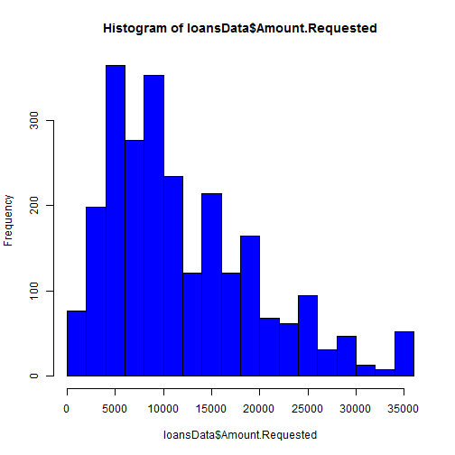 

```r
quantile(loansData$Amount.Requested)
```

```
##    0%   25%   50%   75%  100% 
##  1000  6000 10000 17000 35000
```


```r
hist(loansData$Amount.Funded.By.Investors, col = "blue")
```

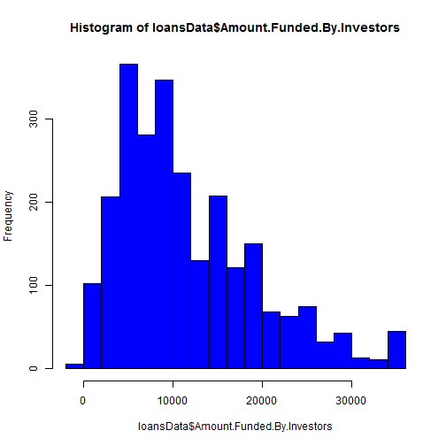 

```r
quantile(loansData$Amount.Funded.By.Investors)
```

```
##       0%      25%      50%      75%     100% 
##    -0.01  6000.00 10000.00 16000.00 35000.00
```


```r
hist(loansData$Interest.Rate, col = "blue")
```

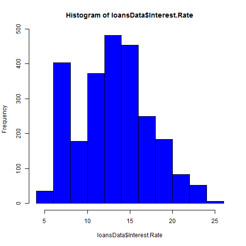 

```r
quantile(loansData$Interest.Rate)
```

```
##    0%   25%   50%   75%  100% 
##  5.42 10.16 13.11 15.80 24.89
```


```r
hist(loansData$Debt.To.Income.Ratio, col = "blue")
```

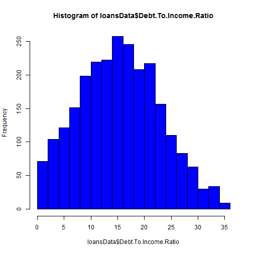 

```r
quantile(loansData$Debt.To.Income.Ratio)
```

```
##    0%   25%   50%   75%  100% 
##  0.00  9.75 15.32 20.68 34.91
```


```r
hist(loansData$Monthly.Income, col = "blue")
```

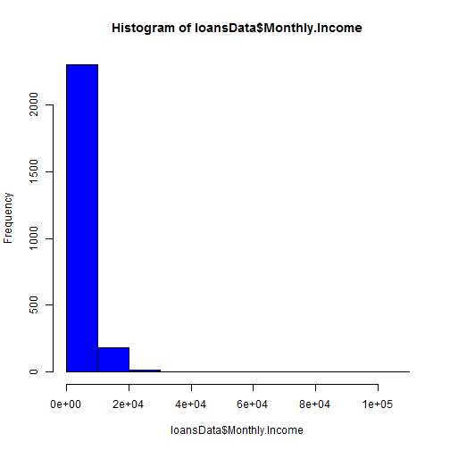 

```r
quantile(loansData$Monthly.Income)
```

```
##       0%      25%      50%      75%     100% 
##    588.5   3500.0   5000.0   6800.0 102750.0
```

```r
plot(loansData$Monthly.Income, col = "blue")
```

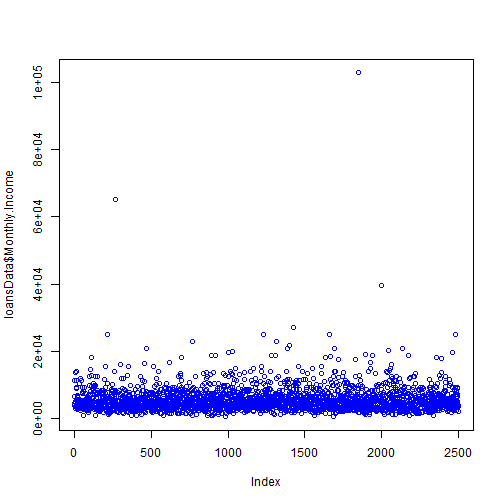 

```r
hist(loansData$Monthly.Income[loansData$Monthly.Income < 39000], col = "blue", 
    breaks = 90)
```

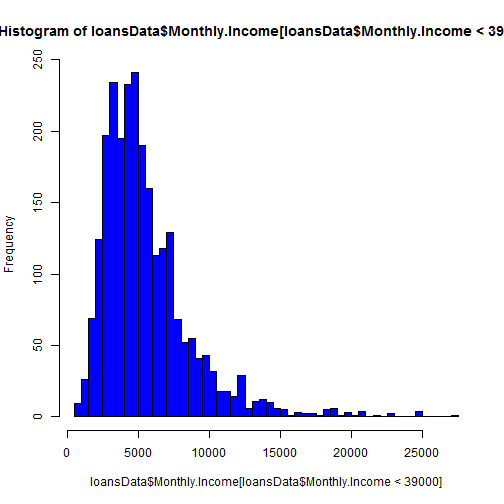 

```r
loansData <- loansData[loansData$Monthly.Income < 39000, ]
```


3 outliers among *Monthly.Income* values


```r
hist(loansData$Open.CREDIT.Lines, col = "blue", breaks = 50)
```

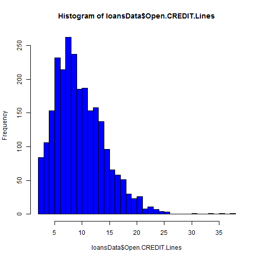 

```r
quantile(loansData$Open.CREDIT.Lines)
```

```
##   0%  25%  50%  75% 100% 
##    2    7    9   13   38
```


```r
hist(loansData$Revolving.CREDIT.Balance, col = "blue")
```

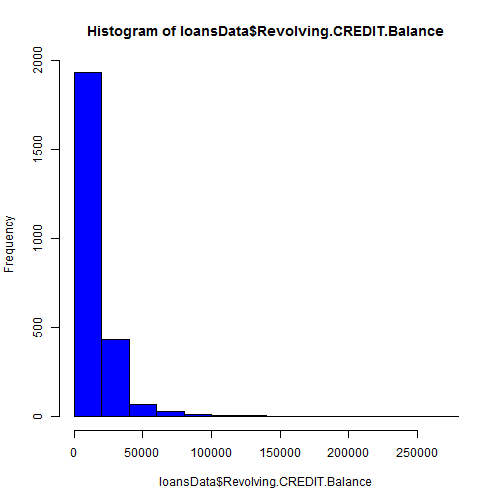 

```r
quantile(loansData$Revolving.CREDIT.Balance)
```

```
##     0%    25%    50%    75%   100% 
##      0   5588  10948  18850 270800
```

```r
plot(loansData$Revolving.CREDIT.Balance, col = "blue")
```

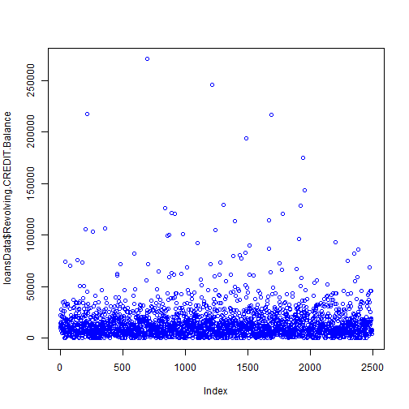 

```r
hist(loansData$Revolving.CREDIT.Balance[loansData$Revolving.CREDIT.Balance < 
    150000], col = "blue", breaks = 60)
```

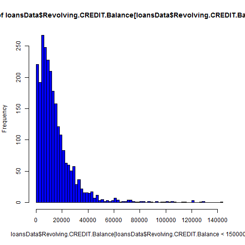 

```r
loansData <- loansData[loansData$Revolving.CREDIT.Balance < 150000, ]
```


6 outliers among *Revolving.Credit.Balance* values


```r
hist(loansData$Inquiries.in.the.Last.6.Months, col = "blue")
```

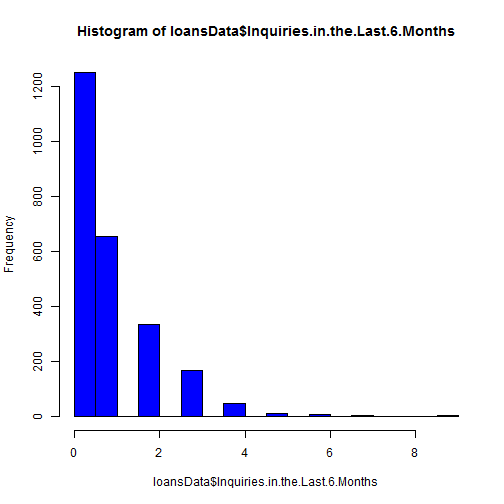 

```r
quantile(loansData$Inquiries.in.the.Last.6.Months)
```

```
##   0%  25%  50%  75% 100% 
##    0    0    0    1    9
```


```r
hist(loansData$Percent.Funded, col = "blue", breaks = 100)
```

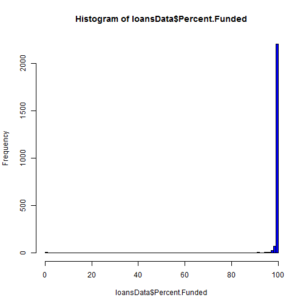 

```r
quantile(loansData$Percent.Funded)
```

```
##     0%    25%    50%    75%   100% 
##   0.00  99.89 100.00 100.00 100.00
```


### Calculate percentage of loans that were 100% funded (or almost 100%) and those which were not funded at all


```r
100 * sum(loansData$Percent.Funded > 98)/nrow(loansData)
```

```
## [1] 91.32
```

```r
100 * sum(loansData$Percent.Funded == 0)/nrow(loansData)
```

```
## [1] 0.2411
```


### Plot interest rate versus FICO range


```r
plot(loansData$FICO.Range, loansData$Interest.Rate, pch = 19, col = "blue", 
    cex = 0.5)
```

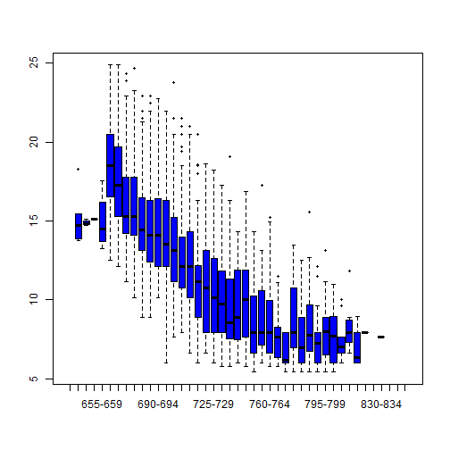 


A clear association between *FICO.Range* and *Interest.Rate*. No big surprise here.

### Plot interest rate versus debt to income ratio

```r
plot(loansData$Debt.To.Income.Ratio, loansData$Interest.Rate, pch = 19, col = "blue", 
    cex = 0.5)
```

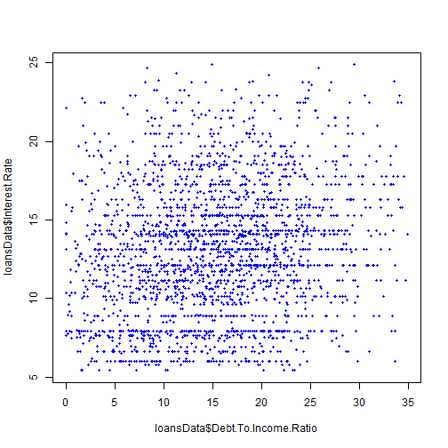 


No clear association between *Debt.To.Income.Ratio* and *Interest.Rate*.

### Plot interest rate versus amount requested

```r
plot(loansData$Amount.Requested, loansData$Interest.Rate, pch = 19, col = "blue", 
    cex = 0.5)
```

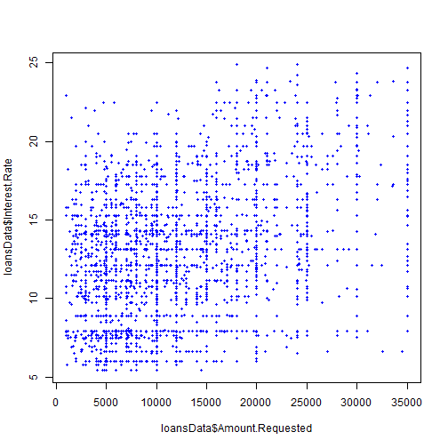 


A not so strong association between *Amount.Requested* and *Interest.Rate*.

### Plot interest rate versus monthly income

```r
plot(loansData$Monthly.Income, loansData$Interest.Rate, pch = 19, col = "blue", 
    cex = 0.5)
```

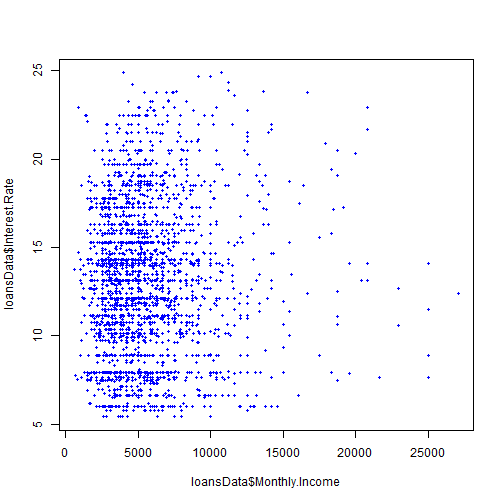 


No clear association between *Monthly.Income* and *Interest.Rate*.

### Plot interest rate versus open credit lines

```r
plot(loansData$Open.CREDIT.Lines, loansData$Interest.Rate, pch = 19, col = "blue", 
    cex = 0.5)
```

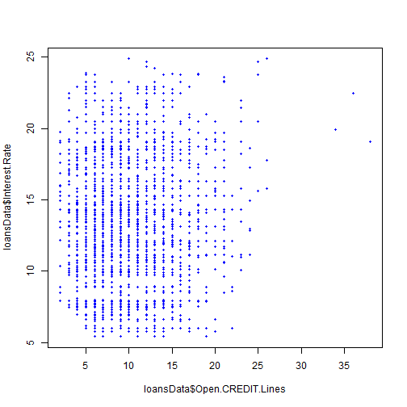 


No clear association between *Open.CREDIT.Lines* and *Interest.Rate*.

### Plot interest rate versus revolving credit balance

```r
plot(loansData$Revolving.CREDIT.Balance, loansData$Interest.Rate, pch = 19, 
    col = "blue", cex = 0.5)
```

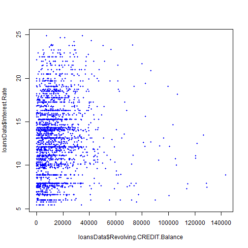 


No clear association between *Revolving.CREDIT.Balance* and *Interest.Rate*.

### Plot interest rate versus employment length

```r
plot(loansData$Employment.Length, loansData$Interest.Rate, pch = 19, col = "blue", 
    cex = 0.5)
```

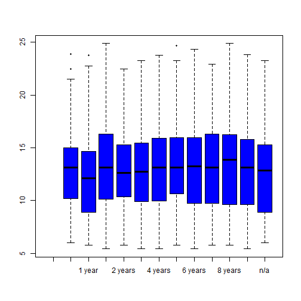 


No clear association between *Employment.Length* and *Interest.Rate*.


------

## Modeling


## Fit a basic model relating interest rate to FICO score


```r
lm1 <- lm(loansData$Interest.Rate ~ loansData$FICO.Range)
summary(lm1)
```

```
## 
## Call:
## lm(formula = loansData$Interest.Rate ~ loansData$FICO.Range)
## 
## Residuals:
##    Min     1Q Median     3Q    Max 
## -8.141 -2.028 -0.507  1.682 10.403 
## 
## Coefficients:
##                             Estimate Std. Error t value Pr(>|t|)    
## (Intercept)                  15.2120     1.2692   11.99  < 2e-16 ***
## loansData$FICO.Range645-649  -0.3287     2.0727   -0.16  0.87402    
## loansData$FICO.Range650-654  -0.0820     3.1090   -0.03  0.97896    
## loansData$FICO.Range655-659  -0.2820     1.9039   -0.15  0.88226    
## loansData$FICO.Range660-664   3.2982     1.2946    2.55  0.01090 *  
## loansData$FICO.Range665-669   2.2799     1.2911    1.77  0.07754 .  
## loansData$FICO.Range670-674   1.0365     1.2877    0.80  0.42094    
## loansData$FICO.Range675-679   0.6427     1.2882    0.50  0.61789    
## loansData$FICO.Range680-684  -0.0853     1.2893   -0.07  0.94725    
## loansData$FICO.Range685-689  -0.5252     1.2922   -0.41  0.68445    
## loansData$FICO.Range690-694  -0.4799     1.2917   -0.37  0.71026    
## loansData$FICO.Range695-699  -1.0708     1.2899   -0.83  0.40655    
## loansData$FICO.Range700-704  -1.8551     1.2932   -1.43  0.15156    
## loansData$FICO.Range705-709  -2.5794     1.2929   -2.00  0.04614 *  
## loansData$FICO.Range710-714  -2.7789     1.2973   -2.14  0.03228 *  
## loansData$FICO.Range715-719  -4.0301     1.3029   -3.09  0.00200 ** 
## loansData$FICO.Range720-724  -4.1762     1.2968   -3.22  0.00130 ** 
## loansData$FICO.Range725-729  -4.5188     1.3029   -3.47  0.00053 ***
## loansData$FICO.Range730-734  -5.2558     1.3026   -4.04  5.6e-05 ***
## loansData$FICO.Range735-739  -5.6098     1.3179   -4.26  2.2e-05 ***
## loansData$FICO.Range740-744  -5.6197     1.3278   -4.23  2.4e-05 ***
## loansData$FICO.Range745-749  -5.3328     1.3278   -4.02  6.1e-05 ***
## loansData$FICO.Range750-754  -6.7443     1.3202   -5.11  3.5e-07 ***
## loansData$FICO.Range755-759  -6.2159     1.3364   -4.65  3.5e-06 ***
## loansData$FICO.Range760-764  -6.6402     1.3379   -4.96  7.4e-07 ***
## loansData$FICO.Range765-769  -7.4287     1.3545   -5.48  4.6e-08 ***
## loansData$FICO.Range770-774  -8.4591     1.4439   -5.86  5.3e-09 ***
## loansData$FICO.Range775-779  -6.4679     1.4061   -4.60  4.4e-06 ***
## loansData$FICO.Range780-784  -7.6227     1.3779   -5.53  3.5e-08 ***
## loansData$FICO.Range785-789  -6.7141     1.4265   -4.71  2.7e-06 ***
## loansData$FICO.Range790-794  -7.6515     1.4191   -5.39  7.6e-08 ***
## loansData$FICO.Range795-799  -6.8205     1.4935   -4.57  5.2e-06 ***
## loansData$FICO.Range800-804  -7.5562     1.5107   -5.00  6.1e-07 ***
## loansData$FICO.Range805-809  -7.8050     1.5545   -5.02  5.5e-07 ***
## loansData$FICO.Range810-814  -6.9183     1.6180   -4.28  2.0e-05 ***
## loansData$FICO.Range815-819  -8.2870     1.7186   -4.82  1.5e-06 ***
## loansData$FICO.Range820-824  -7.3120     3.1090   -2.35  0.01876 *  
## loansData$FICO.Range830-834  -7.5920     3.1090   -2.44  0.01468 *  
## ---
## Signif. codes:  0 '***' 0.001 '**' 0.01 '*' 0.05 '.' 0.1 ' ' 1 
## 
## Residual standard error: 2.84 on 2451 degrees of freedom
## Multiple R-squared: 0.546,	Adjusted R-squared: 0.539 
## F-statistic: 79.6 on 37 and 2451 DF,  p-value: <2e-16
```


## Plot the observed ('black') and fitted ('red') points


```r
plot(loansData$FICO.Range, loansData$Interest.Rate, pch = 19)
points(loansData$FICO.Range, lm1$fitted, pch = 19, col = "red")
```

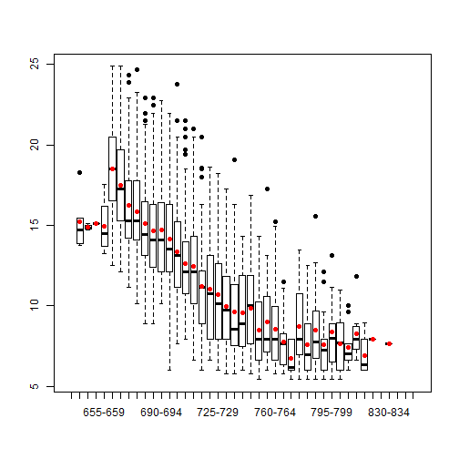 


## Look at residuals versus observations, residuals versus fitted values


```r
par(mfrow = c(1, 2))
plot(loansData$FICO.Range, lm1$residuals, pch = 19)
plot(lm1$fitted, lm1$residuals, pch = 19)
```

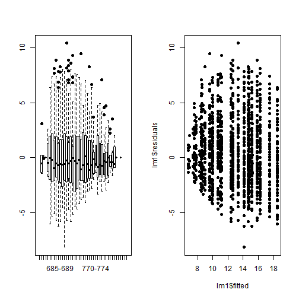 


## Fit a basic model relating interest rate to FICO score and amount requested


```r
lm2 <- lm(loansData$Interest.Rate ~ loansData$Amount.Requested)
summary(lm2)
```

```
## 
## Call:
## lm(formula = loansData$Interest.Rate ~ loansData$Amount.Requested)
## 
## Residuals:
##     Min      1Q  Median      3Q     Max 
## -10.417  -3.021   0.042   2.719  11.915 
## 
## Coefficients:
##                            Estimate Std. Error t value Pr(>|t|)    
## (Intercept)                1.09e+01   1.49e-01    73.0   <2e-16 ***
## loansData$Amount.Requested 1.79e-04   1.02e-05    17.6   <2e-16 ***
## ---
## Signif. codes:  0 '***' 0.001 '**' 0.01 '*' 0.05 '.' 0.1 ' ' 1 
## 
## Residual standard error: 3.94 on 2487 degrees of freedom
## Multiple R-squared: 0.111,	Adjusted R-squared: 0.11 
## F-statistic:  310 on 1 and 2487 DF,  p-value: <2e-16
```

```r
plot(lm2$fitted, lm2$residuals, pch = 19)
```

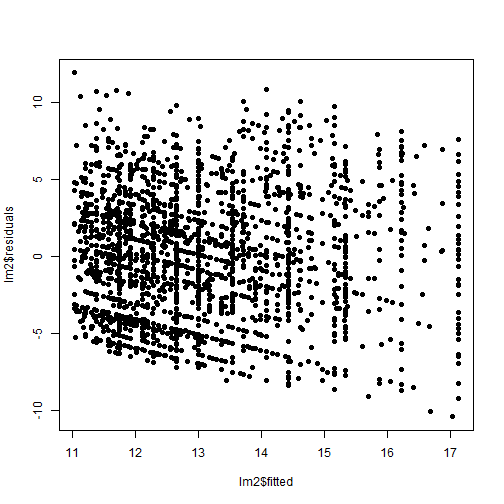 


## Fit a basic model relating interest rate to FICO score and amount requested


```r
lm3 <- lm(loansData$Interest.Rate ~ loansData$FICO.Range + loansData$Amount.Requested)
summary(lm3)
```

```
## 
## Call:
## lm(formula = loansData$Interest.Rate ~ loansData$FICO.Range + 
##     loansData$Amount.Requested)
## 
## Residuals:
##    Min     1Q Median     3Q    Max 
## -8.052 -1.578 -0.167  1.357 10.208 
## 
## Coefficients:
##                              Estimate Std. Error t value Pr(>|t|)    
## (Intercept)                  1.41e+01   1.02e+00   13.81  < 2e-16 ***
## loansData$FICO.Range645-649 -1.06e+00   1.67e+00   -0.63  0.52667    
## loansData$FICO.Range650-654 -5.30e-01   2.51e+00   -0.21  0.83245    
## loansData$FICO.Range655-659 -2.38e-01   1.53e+00   -0.16  0.87681    
## loansData$FICO.Range660-664  1.80e+00   1.04e+00    1.72  0.08579 .  
## loansData$FICO.Range665-669  1.06e+00   1.04e+00    1.02  0.30717    
## loansData$FICO.Range670-674 -1.02e-01   1.04e+00   -0.10  0.92204    
## loansData$FICO.Range675-679 -8.15e-01   1.04e+00   -0.78  0.43290    
## loansData$FICO.Range680-684 -1.54e+00   1.04e+00   -1.48  0.13946    
## loansData$FICO.Range685-689 -2.08e+00   1.04e+00   -1.99  0.04650 *  
## loansData$FICO.Range690-694 -2.38e+00   1.04e+00   -2.28  0.02245 *  
## loansData$FICO.Range695-699 -2.84e+00   1.04e+00   -2.73  0.00633 ** 
## loansData$FICO.Range700-704 -3.60e+00   1.04e+00   -3.45  0.00057 ***
## loansData$FICO.Range705-709 -4.40e+00   1.04e+00   -4.22  2.6e-05 ***
## loansData$FICO.Range710-714 -4.56e+00   1.05e+00   -4.36  1.4e-05 ***
## loansData$FICO.Range715-719 -5.73e+00   1.05e+00   -5.45  5.6e-08 ***
## loansData$FICO.Range720-724 -5.86e+00   1.05e+00   -5.60  2.3e-08 ***
## loansData$FICO.Range725-729 -6.23e+00   1.05e+00   -5.93  3.5e-09 ***
## loansData$FICO.Range730-734 -7.00e+00   1.05e+00   -6.66  3.3e-11 ***
## loansData$FICO.Range735-739 -7.74e+00   1.06e+00   -7.27  4.7e-13 ***
## loansData$FICO.Range740-744 -7.58e+00   1.07e+00   -7.08  1.9e-12 ***
## loansData$FICO.Range745-749 -7.12e+00   1.07e+00   -6.64  3.8e-11 ***
## loansData$FICO.Range750-754 -8.20e+00   1.07e+00   -7.70  1.9e-14 ***
## loansData$FICO.Range755-759 -8.11e+00   1.08e+00   -7.52  7.8e-14 ***
## loansData$FICO.Range760-764 -8.24e+00   1.08e+00   -7.63  3.4e-14 ***
## loansData$FICO.Range765-769 -8.85e+00   1.09e+00   -8.10  8.6e-16 ***
## loansData$FICO.Range770-774 -1.02e+01   1.16e+00   -8.73  < 2e-16 ***
## loansData$FICO.Range775-779 -8.62e+00   1.14e+00   -7.59  4.5e-14 ***
## loansData$FICO.Range780-784 -9.04e+00   1.11e+00   -8.13  6.8e-16 ***
## loansData$FICO.Range785-789 -8.48e+00   1.15e+00   -7.36  2.4e-13 ***
## loansData$FICO.Range790-794 -9.44e+00   1.15e+00   -8.24  2.8e-16 ***
## loansData$FICO.Range795-799 -8.42e+00   1.20e+00   -6.99  3.6e-12 ***
## loansData$FICO.Range800-804 -8.73e+00   1.22e+00   -7.16  1.0e-12 ***
## loansData$FICO.Range805-809 -9.88e+00   1.25e+00   -7.88  5.0e-15 ***
## loansData$FICO.Range810-814 -9.90e+00   1.31e+00   -7.57  5.1e-14 ***
## loansData$FICO.Range815-819 -9.67e+00   1.39e+00   -6.98  3.8e-12 ***
## loansData$FICO.Range820-824 -7.87e+00   2.51e+00   -3.14  0.00171 ** 
## loansData$FICO.Range830-834 -1.09e+01   2.51e+00   -4.34  1.5e-05 ***
## loansData$Amount.Requested   2.18e-04   5.99e-06   36.35  < 2e-16 ***
## ---
## Signif. codes:  0 '***' 0.001 '**' 0.01 '*' 0.05 '.' 0.1 ' ' 1 
## 
## Residual standard error: 2.29 on 2450 degrees of freedom
## Multiple R-squared: 0.705,	Adjusted R-squared:  0.7 
## F-statistic:  154 on 38 and 2450 DF,  p-value: <2e-16
```

```r
plot(lm3$fitted, lm3$residuals, pch = 19)
```

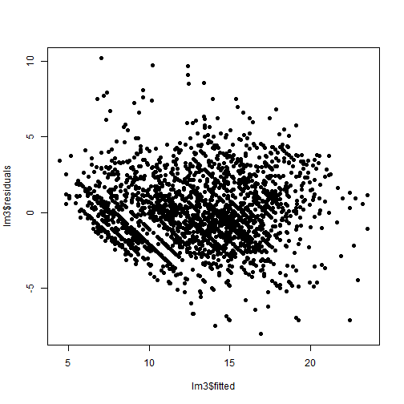 


## Fit a basic model relating interest rate to FICO score and loan length


```r
lm4 <- lm(loansData$Interest.Rate ~ loansData$FICO.Range + loansData$Loan.Length)
summary(lm4)
```

```
## 
## Call:
## lm(formula = loansData$Interest.Rate ~ loansData$FICO.Range + 
##     loansData$Loan.Length)
## 
## Residuals:
##     Min      1Q  Median      3Q     Max 
## -11.401  -1.420  -0.176   1.238  10.407 
## 
## Coefficients:
##                                Estimate Std. Error t value Pr(>|t|)    
## (Intercept)                      15.212      0.975   15.60  < 2e-16 ***
## loansData$FICO.Range645-649      -0.329      1.592   -0.21  0.83644    
## loansData$FICO.Range650-654      -0.082      2.388   -0.03  0.97261    
## loansData$FICO.Range655-659      -0.282      1.462   -0.19  0.84709    
## loansData$FICO.Range660-664       2.202      0.995    2.21  0.02692 *  
## loansData$FICO.Range665-669       1.367      0.992    1.38  0.16841    
## loansData$FICO.Range670-674       0.344      0.989    0.35  0.72785    
## loansData$FICO.Range675-679      -0.229      0.990   -0.23  0.81713    
## loansData$FICO.Range680-684      -1.007      0.991   -1.02  0.30948    
## loansData$FICO.Range685-689      -1.421      0.993   -1.43  0.15235    
## loansData$FICO.Range690-694      -1.576      0.992   -1.59  0.11241    
## loansData$FICO.Range695-699      -2.196      0.991   -2.22  0.02682 *  
## loansData$FICO.Range700-704      -2.960      0.994   -2.98  0.00292 ** 
## loansData$FICO.Range705-709      -3.634      0.993   -3.66  0.00026 ***
## loansData$FICO.Range710-714      -3.757      0.997   -3.77  0.00017 ***
## loansData$FICO.Range715-719      -4.926      1.001   -4.92  9.2e-07 ***
## loansData$FICO.Range720-724      -5.138      0.996   -5.16  2.7e-07 ***
## loansData$FICO.Range725-729      -5.462      1.001   -5.46  5.3e-08 ***
## loansData$FICO.Range730-734      -6.282      1.001   -6.28  4.1e-10 ***
## loansData$FICO.Range735-739      -6.569      1.012   -6.49  1.0e-10 ***
## loansData$FICO.Range740-744      -6.695      1.020   -6.56  6.4e-11 ***
## loansData$FICO.Range745-749      -6.904      1.020   -6.77  1.7e-11 ***
## loansData$FICO.Range750-754      -7.463      1.014   -7.36  2.5e-13 ***
## loansData$FICO.Range755-759      -7.455      1.027   -7.26  5.2e-13 ***
## loansData$FICO.Range760-764      -7.420      1.028   -7.22  6.9e-13 ***
## loansData$FICO.Range765-769      -8.038      1.040   -7.73  1.6e-14 ***
## loansData$FICO.Range770-774      -8.717      1.109   -7.86  5.7e-15 ***
## loansData$FICO.Range775-779      -7.464      1.080   -6.91  6.2e-12 ***
## loansData$FICO.Range780-784      -8.719      1.059   -8.24  2.9e-16 ***
## loansData$FICO.Range785-789      -8.099      1.096   -7.39  2.0e-13 ***
## loansData$FICO.Range790-794      -8.309      1.090   -7.62  3.5e-14 ***
## loansData$FICO.Range795-799      -8.844      1.148   -7.70  1.9e-14 ***
## loansData$FICO.Range800-804      -8.652      1.161   -7.46  1.2e-13 ***
## loansData$FICO.Range805-809      -8.682      1.194   -7.27  4.8e-13 ***
## loansData$FICO.Range810-814      -6.918      1.243   -5.57  2.9e-08 ***
## loansData$FICO.Range815-819      -9.018      1.320   -6.83  1.1e-11 ***
## loansData$FICO.Range820-824      -7.312      2.388   -3.06  0.00222 ** 
## loansData$FICO.Range830-834      -7.592      2.388   -3.18  0.00149 ** 
## loansData$Loan.Length60 months    4.384      0.106   41.29  < 2e-16 ***
## ---
## Signif. codes:  0 '***' 0.001 '**' 0.01 '*' 0.05 '.' 0.1 ' ' 1 
## 
## Residual standard error: 2.18 on 2450 degrees of freedom
## Multiple R-squared: 0.732,	Adjusted R-squared: 0.728 
## F-statistic:  176 on 38 and 2450 DF,  p-value: <2e-16
```


## Fit a basic model relating interest rate to FICO score, amount requested and loan length


```r
lm5 <- lm(loansData$Interest.Rate ~ loansData$Amount.Requested + loansData$Loan.Length + 
    loansData$FICO.Range)
summary(lm5)
```

```
## 
## Call:
## lm(formula = loansData$Interest.Rate ~ loansData$Amount.Requested + 
##     loansData$Loan.Length + loansData$FICO.Range)
## 
## Residuals:
##    Min     1Q Median     3Q    Max 
## -9.599 -1.284 -0.098  1.086 10.480 
## 
## Coefficients:
##                                 Estimate Std. Error t value Pr(>|t|)    
## (Intercept)                     1.45e+01   8.64e-01   16.79  < 2e-16 ***
## loansData$Amount.Requested      1.44e-04   5.56e-06   26.00  < 2e-16 ***
## loansData$Loan.Length60 months  3.26e+00   1.03e-01   31.53  < 2e-16 ***
## loansData$FICO.Range645-649    -8.13e-01   1.41e+00   -0.58  0.56418    
## loansData$FICO.Range650-654    -3.80e-01   2.11e+00   -0.18  0.85751    
## loansData$FICO.Range655-659    -2.53e-01   1.29e+00   -0.20  0.84524    
## loansData$FICO.Range660-664     1.48e+00   8.81e-01    1.69  0.09208 .  
## loansData$FICO.Range665-669     7.93e-01   8.78e-01    0.90  0.36688    
## loansData$FICO.Range670-674    -2.34e-01   8.76e-01   -0.27  0.78925    
## loansData$FICO.Range675-679    -9.74e-01   8.77e-01   -1.11  0.26685    
## loansData$FICO.Range680-684    -1.74e+00   8.77e-01   -1.98  0.04810 *  
## loansData$FICO.Range685-689    -2.22e+00   8.79e-01   -2.53  0.01159 *  
## loansData$FICO.Range690-694    -2.56e+00   8.80e-01   -2.91  0.00367 ** 
## loansData$FICO.Range695-699    -3.09e+00   8.78e-01   -3.51  0.00045 ***
## loansData$FICO.Range700-704    -3.84e+00   8.80e-01   -4.36  1.4e-05 ***
## loansData$FICO.Range705-709    -4.57e+00   8.80e-01   -5.20  2.2e-07 ***
## loansData$FICO.Range710-714    -4.69e+00   8.83e-01   -5.31  1.2e-07 ***
## loansData$FICO.Range715-719    -5.82e+00   8.87e-01   -6.57  6.3e-11 ***
## loansData$FICO.Range720-724    -6.01e+00   8.83e-01   -6.81  1.2e-11 ***
## loansData$FICO.Range725-729    -6.36e+00   8.87e-01   -7.17  1.0e-12 ***
## loansData$FICO.Range730-734    -7.18e+00   8.87e-01   -8.10  8.8e-16 ***
## loansData$FICO.Range735-739    -7.74e+00   8.98e-01   -8.62  < 2e-16 ***
## loansData$FICO.Range740-744    -7.72e+00   9.04e-01   -8.54  < 2e-16 ***
## loansData$FICO.Range745-749    -7.69e+00   9.04e-01   -8.50  < 2e-16 ***
## loansData$FICO.Range750-754    -8.25e+00   8.98e-01   -9.18  < 2e-16 ***
## loansData$FICO.Range755-759    -8.39e+00   9.10e-01   -9.23  < 2e-16 ***
## loansData$FICO.Range760-764    -8.28e+00   9.11e-01   -9.09  < 2e-16 ***
## loansData$FICO.Range765-769    -8.83e+00   9.22e-01   -9.57  < 2e-16 ***
## loansData$FICO.Range770-774    -9.79e+00   9.83e-01   -9.96  < 2e-16 ***
## loansData$FICO.Range775-779    -8.63e+00   9.57e-01   -9.02  < 2e-16 ***
## loansData$FICO.Range780-784    -9.38e+00   9.38e-01  -10.00  < 2e-16 ***
## loansData$FICO.Range785-789    -8.91e+00   9.71e-01   -9.18  < 2e-16 ***
## loansData$FICO.Range790-794    -9.33e+00   9.66e-01   -9.65  < 2e-16 ***
## loansData$FICO.Range795-799    -9.39e+00   1.02e+00   -9.23  < 2e-16 ***
## loansData$FICO.Range800-804    -9.15e+00   1.03e+00   -8.90  < 2e-16 ***
## loansData$FICO.Range805-809    -9.84e+00   1.06e+00   -9.30  < 2e-16 ***
## loansData$FICO.Range810-814    -8.90e+00   1.10e+00   -8.07  1.1e-15 ***
## loansData$FICO.Range815-819    -9.75e+00   1.17e+00   -8.34  < 2e-16 ***
## loansData$FICO.Range820-824    -7.68e+00   2.11e+00   -3.63  0.00029 ***
## loansData$FICO.Range830-834    -9.79e+00   2.12e+00   -4.63  3.9e-06 ***
## ---
## Signif. codes:  0 '***' 0.001 '**' 0.01 '*' 0.05 '.' 0.1 ' ' 1 
## 
## Residual standard error: 1.93 on 2449 degrees of freedom
## Multiple R-squared: 0.79,	Adjusted R-squared: 0.787 
## F-statistic:  236 on 39 and 2449 DF,  p-value: <2e-16
```


## Let's use model 4


```r
summary(lm4)
```

```
## 
## Call:
## lm(formula = loansData$Interest.Rate ~ loansData$FICO.Range + 
##     loansData$Loan.Length)
## 
## Residuals:
##     Min      1Q  Median      3Q     Max 
## -11.401  -1.420  -0.176   1.238  10.407 
## 
## Coefficients:
##                                Estimate Std. Error t value Pr(>|t|)    
## (Intercept)                      15.212      0.975   15.60  < 2e-16 ***
## loansData$FICO.Range645-649      -0.329      1.592   -0.21  0.83644    
## loansData$FICO.Range650-654      -0.082      2.388   -0.03  0.97261    
## loansData$FICO.Range655-659      -0.282      1.462   -0.19  0.84709    
## loansData$FICO.Range660-664       2.202      0.995    2.21  0.02692 *  
## loansData$FICO.Range665-669       1.367      0.992    1.38  0.16841    
## loansData$FICO.Range670-674       0.344      0.989    0.35  0.72785    
## loansData$FICO.Range675-679      -0.229      0.990   -0.23  0.81713    
## loansData$FICO.Range680-684      -1.007      0.991   -1.02  0.30948    
## loansData$FICO.Range685-689      -1.421      0.993   -1.43  0.15235    
## loansData$FICO.Range690-694      -1.576      0.992   -1.59  0.11241    
## loansData$FICO.Range695-699      -2.196      0.991   -2.22  0.02682 *  
## loansData$FICO.Range700-704      -2.960      0.994   -2.98  0.00292 ** 
## loansData$FICO.Range705-709      -3.634      0.993   -3.66  0.00026 ***
## loansData$FICO.Range710-714      -3.757      0.997   -3.77  0.00017 ***
## loansData$FICO.Range715-719      -4.926      1.001   -4.92  9.2e-07 ***
## loansData$FICO.Range720-724      -5.138      0.996   -5.16  2.7e-07 ***
## loansData$FICO.Range725-729      -5.462      1.001   -5.46  5.3e-08 ***
## loansData$FICO.Range730-734      -6.282      1.001   -6.28  4.1e-10 ***
## loansData$FICO.Range735-739      -6.569      1.012   -6.49  1.0e-10 ***
## loansData$FICO.Range740-744      -6.695      1.020   -6.56  6.4e-11 ***
## loansData$FICO.Range745-749      -6.904      1.020   -6.77  1.7e-11 ***
## loansData$FICO.Range750-754      -7.463      1.014   -7.36  2.5e-13 ***
## loansData$FICO.Range755-759      -7.455      1.027   -7.26  5.2e-13 ***
## loansData$FICO.Range760-764      -7.420      1.028   -7.22  6.9e-13 ***
## loansData$FICO.Range765-769      -8.038      1.040   -7.73  1.6e-14 ***
## loansData$FICO.Range770-774      -8.717      1.109   -7.86  5.7e-15 ***
## loansData$FICO.Range775-779      -7.464      1.080   -6.91  6.2e-12 ***
## loansData$FICO.Range780-784      -8.719      1.059   -8.24  2.9e-16 ***
## loansData$FICO.Range785-789      -8.099      1.096   -7.39  2.0e-13 ***
## loansData$FICO.Range790-794      -8.309      1.090   -7.62  3.5e-14 ***
## loansData$FICO.Range795-799      -8.844      1.148   -7.70  1.9e-14 ***
## loansData$FICO.Range800-804      -8.652      1.161   -7.46  1.2e-13 ***
## loansData$FICO.Range805-809      -8.682      1.194   -7.27  4.8e-13 ***
## loansData$FICO.Range810-814      -6.918      1.243   -5.57  2.9e-08 ***
## loansData$FICO.Range815-819      -9.018      1.320   -6.83  1.1e-11 ***
## loansData$FICO.Range820-824      -7.312      2.388   -3.06  0.00222 ** 
## loansData$FICO.Range830-834      -7.592      2.388   -3.18  0.00149 ** 
## loansData$Loan.Length60 months    4.384      0.106   41.29  < 2e-16 ***
## ---
## Signif. codes:  0 '***' 0.001 '**' 0.01 '*' 0.05 '.' 0.1 ' ' 1 
## 
## Residual standard error: 2.18 on 2450 degrees of freedom
## Multiple R-squared: 0.732,	Adjusted R-squared: 0.728 
## F-statistic:  176 on 38 and 2450 DF,  p-value: <2e-16
```

```r
confint(lm4)
```

```
##                                   2.5 %  97.5 %
## (Intercept)                     13.3004 17.1236
## loansData$FICO.Range645-649     -3.4502  2.7929
## loansData$FICO.Range650-654     -4.7643  4.6003
## loansData$FICO.Range655-659     -3.1493  2.5853
## loansData$FICO.Range660-664      0.2518  4.1526
## loansData$FICO.Range665-669     -0.5785  3.3114
## loansData$FICO.Range670-674     -1.5953  2.2838
## loansData$FICO.Range675-679     -2.1694  1.7117
## loansData$FICO.Range680-684     -2.9491  0.9354
## loansData$FICO.Range685-689     -3.3679  0.5253
## loansData$FICO.Range690-694     -3.5221  0.3701
## loansData$FICO.Range695-699     -4.1392 -0.2522
## loansData$FICO.Range700-704     -4.9080 -1.0111
## loansData$FICO.Range705-709     -5.5821 -1.6865
## loansData$FICO.Range710-714     -5.7118 -1.8032
## loansData$FICO.Range715-719     -6.8885 -2.9630
## loansData$FICO.Range720-724     -7.0912 -3.1841
## loansData$FICO.Range725-729     -7.4244 -3.4988
## loansData$FICO.Range730-734     -8.2443 -4.3196
## loansData$FICO.Range735-739     -8.5542 -4.5835
## loansData$FICO.Range740-744     -8.6955 -4.6948
## loansData$FICO.Range745-749     -8.9055 -4.9034
## loansData$FICO.Range750-754     -9.4517 -5.4744
## loansData$FICO.Range755-759     -9.4686 -5.4413
## loansData$FICO.Range760-764     -9.4349 -5.4043
## loansData$FICO.Range765-769    -10.0778 -5.9974
## loansData$FICO.Range770-774    -10.8916 -6.5423
## loansData$FICO.Range775-779     -9.5825 -5.3461
## loansData$FICO.Range780-784    -10.7946 -6.6429
## loansData$FICO.Range785-789    -10.2480 -5.9492
## loansData$FICO.Range790-794    -10.4465 -6.1717
## loansData$FICO.Range795-799    -11.0953 -6.5926
## loansData$FICO.Range800-804    -10.9280 -6.3764
## loansData$FICO.Range805-809    -11.0234 -6.3403
## loansData$FICO.Range810-814     -9.3550 -4.4815
## loansData$FICO.Range815-819    -11.6062 -6.4292
## loansData$FICO.Range820-824    -11.9943 -2.6297
## loansData$FICO.Range830-834    -12.2743 -2.9097
## loansData$Loan.Length60 months   4.1760  4.5924
```

```r


par(mfrow = c(2, 2))

hist(loansData$Amount.Requested, col = "blue", breaks = 20, main = "", xlab = "Amount requested (in dollars)")
plot(loansData$FICO.Range, loansData$Interest.Rate, pch = 19, col = "blue", 
    cex = 0.5, xlab = "FICO score range", ylab = "Interest rate (%)")
plot(lm2$fitted, lm2$residuals, pch = 19, col = loansData$Loan.Length, xlab = "Interest rate (%)", 
    ylab = "No Adjustment Residuals")
plot(lm4$fitted, lm4$residuals, pch = 19, col = loansData$Loan.Length, xlab = "Interest rate (%)", 
    ylab = "Adjusted Residuals")
```

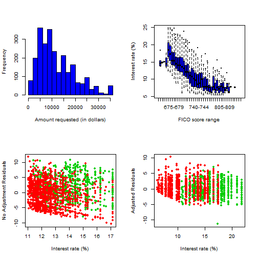 

```r

```


